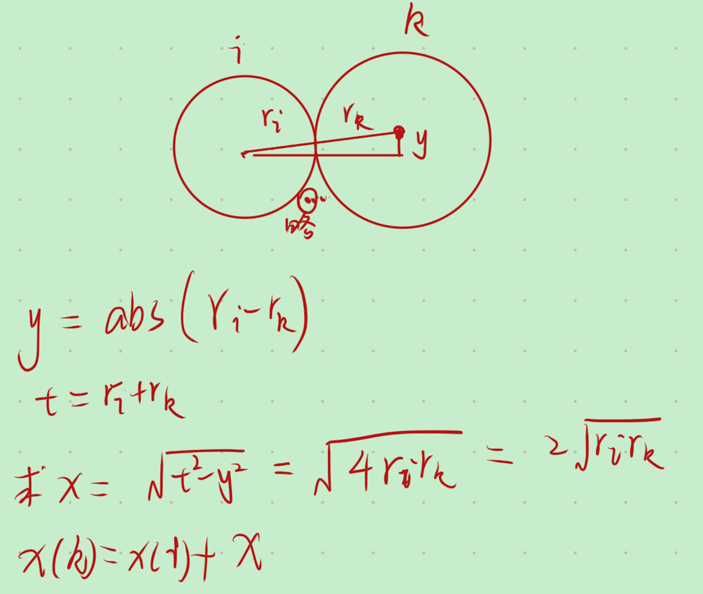

# 收纳盘子
https://blog.csdn.net/weixin_45736829/article/details/106784379
dfs 生成全排列
注意每个圆不一定刚好和它前一个圆相切，但一定和它之前的一个圆相切。

求每个圆圆心$centerX$，$l=centerX[1]-r[1],r=r[n]+centerX[n]$
然后最优答案为$r-l$
```c fold
#include <cmath>
#include <iostream>
#define N 50

using namespace std;
//半径	圆心横坐标
double r[N], centerX[N];
//最短圆排列长度
double minlength;

//每个圆的圆心位置
double getCenterX(int k) {
    double tmp = 0;
    for (int i = 0; i < k; i++) {
        double value = centerX[i] + 2.0 * sqrt(r[k] * r[i]);
        if (value > tmp) {
            tmp = value;
        }
    }
    return tmp;
}

//得到当前圆排列长度
void getLength(int num) {
    double left = 0xffff, right = -0xffff;
    for (int i = 0; i < num; i++) {
        if (centerX[i] - r[i] < left)
            left = centerX[i] - r[i];
        if (centerX[i] + r[i] > right)
            right = centerX[i] + r[i];
    }
    if (right - left < minlength)
        minlength = right - left;
}

void dfs(int k, int num) {
    if (k == num) {
        getLength(num);
    } else {
        for (int j = k; j < num; ++j) {
            swap(r[k], r[j]);
            double nowX = getCenterX(k);
            if (nowX + r[k] + r[0] < minlength) {//剪枝
                centerX[k] = nowX;
                dfs(k + 1, num);
            }
            swap(r[k], r[j]);
        }
    }
}

int main() {
    // freopen("1.txt", "r", stdin);
    int n;
    minlength = 0xffffff;
    cin >> n;
    for (int i = 0; i < n; i++)
        cin >> r[i];
    dfs(0, n);
    printf("%.2lf", minlength);
    return 0;
}

```

# 有效的括号组合数量
搜索所有括号组合情况+栈判断括号是否合法
```c fold
#include <algorithm>
#include <iostream>
#include <stack>

using namespace std;
const int N = 50;
bool a[N];//括号序列，其中0位(,1为)
int n;
bool check(bool *a) {
    stack<bool> st;
    for (int i = 0; i < 2 * n; i++) {
        if (!a[i]) {
            st.push(a[i]);
        } else {
            if (st.empty()) {
                return false;
            } else {
                st.pop();
            }
        }
    }
    return st.empty();
}
int ans = 0;
//now 当前是第几个,sum一共几个了，
void dfs(int now, int sum, bool *a) {
    if (sum == 2 * n) {
        if (check(a)) {
            // for (int i = 0; i < 2 * n; i++) cout << a[i];
            // cout << endl;
            ans++;
        }
        return;
    }
    dfs(now + 1, sum + 1, a);//a[now]=0;
    a[now] = 1;
    dfs(now + 1, sum + 1, a);
    a[now] = 0;
}
int main() {
    cin >> n;
    dfs(0, 0, a);
    cout << ans;
    return 0;
}
```