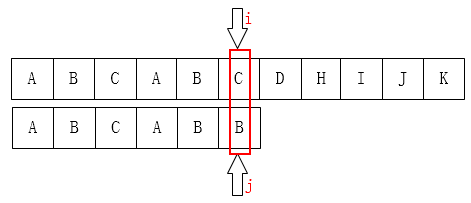

# 一、实验目的
1. 比较KMP算法和BM算法的性能差异，包括字符比较次数和搜索时间等指标。
2. 分析KMP算法和BM算法在不同场景下的适用性
# 二、实验条件
1. 硬件环境：
	内存大小：16.0GB
	处理器：12th Gen Intel(R)Core(TM)i7-12700H
2. 软件环境：
	操作系统：基于 x64 的电脑
	编程语言：c++
	编译器版本：TDM-GCC 4.9.2 64-bit Debug
# 三、实验设计
## 1.构造字符串
随机生成主串和模式串
1. 主串长度可输入。
2. 模式串长度有短，中，长三种类型，可以根据输入选择。
3. 模式串可以在主串的前、中、后部，可以根据输入选择。
4. 模式串类型有三种，也可以根据输入选择：
- 只包含$[0,9]$数字的模式字符串 
- 只包含$[a,z]$小写字母的模式字符串 
- 包含ASCII 33~126 的模式字符串（部分字符，大小写字母，数字）
5. 默认模式串长度小于主串长度的一半
为了保证主串含有模式串，将主串分成三部分，根据3随机生成模式串位置，然后随机生成前后部分的字符串，最后$主串=前半部分的字符串+模式串+后半部分的字符串$

代码详见附录
## 2. KMP算法实现方法 
利用模式串自身的**部分重复**这种性质，跳过一些不必要的回溯，提高匹配效率。
$Next[]$数组记录**最长相等前后缀**，每次不匹配时模式串指针$j$就跳到最长相等前后缀的**前缀开始的位置**。
KMP算法的时间复杂度主要由两部分组成：预处理部分和匹配部分。
1. 预处理部分：计算模式串的最长公共前缀和后缀。时间复杂度为$O(m)$。
2. 匹配部分：在最坏的情况下，这一步的时间复杂度为$O(n)$。
>KMP算法的总时间复杂度为$O(m+n)$
### 原理详解
字符串下标从0开始，$i$是主串指针，$j$模式串指针，P[]模式串，T[]主串
例如到此处匹配失败



设$j$下一次移到$k$
$i$可以不回溯，因为知道之前的都是匹配的$T[i-j,i-1]=P[0,j-1]$，
（包含$T[i-k , i-1]=P[j-k,j-1]$)
由于$P[0,k-1]=P[j-k,j-1]$，则有$P[0 , k-1] = T[i-k , i-1]$


### 代码实现
见附录
## 3. BM算法实现方法
### 原理详解
BM算法是基于暴力算法的优化，通过**综合**运用**坏字符**规则和**好后缀**规则提高算法效率。

坏字符规则：从右往左匹配，找到主串中第一个不匹配的字符(坏字符)，模式串指针继续往前（模式串右移），直到找到和坏字符一样的字符（模式串出现与主串坏字符对齐）。如果找到了，模式串移到该坏字符处；如果没有，则直接移到该坏字符的下一位，最右出现位置为-1

好后缀规则：从右往左匹配，找到坏字符（意味着该坏字符后面的串是匹配的，即为好后缀），往左寻找模式串中是否还有该**好后缀**。当字符失配时，后移位数 = 好后缀在模式串中的位置 - 好后缀在模式串上一次出现的位置，且如果好后缀在模式串中没有再次出现，则为-1

```text
   1. 找出好后缀的所有后缀子串 
   2. 找出模式串的所有前缀子串
   3. 找到好后缀中最长的能和模式串的前缀子串匹配的后缀子串
   
注意：好后缀的后缀子串，本身也是模式串的后缀子串，所以我们可以利用这个在模式串中找到另外的对应匹配的字符
```
注意：BM算法是倒着匹配的。为什么要倒着匹配？
	提高匹配效率：从右向左匹配可以有效地避免在匹配过程中反复比较同一个字符，从而提高匹配的效率。
两种规则**综合使用**，哪种移动的位数多使用哪种
>时间复杂度：$O(n/m)$,最坏$O(m*n)$
### 代码实现
见附录
## 4. 性能测试方法：
### 准确性测试
这里是返回模式串在主串中的位置。
已经满分通过了oj平台的测试样例。

使用如下代码进行了准确性测试。
```c
#include <bits/stdc++.h>
using namespace std;
int main(){
    for(int i=1;i<=10000;i++){
        system("build");
        system("KMP < in.txt > KMP.out");
        system("BM < in.txt > BM.out");
        if(system("fc KMP.out BM.out")){
            puts("!!!!!!");
            while(1);
        }
    }
    return 0;
}
```
多次比对，更改构造的字符串后，实验结果都如下图：
![[Pasted image 20231017200116.png]]
### 字符比较次数和搜索时间
>为确保实验过程中的随机性，采用多次运行实验并取平均值的方法求字符比较次数。  

>程序运行时间通常较短，难以比较，采用多次运行实验求时间和的方法比较搜索时间。

为减小随机误差，每个条件都运行$n=100$次，时间取累加和，比较次数取平均值

收集数据步骤：
1. 通过改变$build.cpp$更改以下四项实验条件
	1. 主串长度：
	2. 模式串长度
	3. 模式串在主串中的位置 (1-前，2-中，3-后)
	4. 模式串类型 (1-数字，2-字母，3-ASCII 33-126)
2. 运行$main.cpp$
	先清空$KMP.txt$和$BM.txt$.
	运行$build.cpp$构造随机字符串，写入$test.txt$
	然后分别运行$KMP.cpp$和$BM.cpp$，从$test.txt$写入数据，将得到的数据分别写入$KMP.txt$和$BM.txt$.
	计算得到最终数据写入$conclusion.txt$
3. 将$conclusion.txt$的数据复制粘贴到$数据结论.xlsx$的特定位置。

#### 代码实现
见附录
# 四、实验结果与分析
>全部数据见附件$数据结论.xlsx$

主串长度只有在1e6数量级时单个程序运行时间>0.01s，可以被记录，其他情况单个程序运行时间有一部分<0.01s，系统直接记录为0，所以程序的累积时间在主串长度不足1e6的情况下不具有参考价值。
$$
时间差=KMP搜索时间-BM搜索时间 
$$
$$时间差百分比=abs(时间差))/min(BM搜索时间,KMP搜索时间)$$
$$次数差=KMP平均比较次数-BM平均比较次数$$
$$次数差百分比=abs(次数差))/min(KMP平均比较次数,BM平均比较次数)$$
（一）主串长度的影响
	主串长度越长，对同一种算法搜索时间越长，平均字符比较次数也呈增长态势。
	对于短模式串的场景，主串越长，KMP算法的性能优势越明显。
	![[Pasted image 20231018164129.png]]
（二）模式串长度的影响
1. 在模式串很短的情况下（长度为10）KMP算法性能明显优于BM 算法。平均次数差额百分比为257.47%。
	![[Pasted image 20231018115918.png]]
2. 在模式串中等的情况下（长度为200）BM算法性能明显优于KMP算法。平均次数差额百分比为79.63%。
	![[Pasted image 20231018120842.png]]
3. 在模式串较长的情况下（长度为500）BM算法性能明显优于KMP算法。平均次数差额百分比为97.81%。在主串长的情况下尤为明显，平均次数差额百分比高达257.00%。
	![[Pasted image 20231018121341.png]]
	（三）模式串在主串中的位置 (1-前，2-中，3-后)
1. 对于一种算法模式串在主串中的位置越靠前，平均匹配次数越少。
	![[Pasted image 20231018161811.png]]
2. 模式串在前/中/后时（即固定模式串位置），对于较短的模式串，KMP算法性能明显优于BM算法。
	![[Pasted image 20231018161445.png]]在主串长度充分长时，KMP算法性能明显优于BM算法。在不充分长时，两者差异不大。
	（四）模式串类型 (1-数字，2-字母，3-ASCII 33-126)
	固定其他条件，模式串类型对算法性能影响很小，可忽略。
	![[Pasted image 20231018162010.png]]

（五）综合
	据统计，次数差为正数的有96个，次数差为负数的有57个，即BM算法性能更优的概率为62.75%，KMP算法性能更优的概率为37.25%。
	时间差为正数的有102个，为负数的有49个，为0的有2个，即BM算法用时更短的概率为66.67%，KMP算法性能更优的概率为32.03%。
# 五、结论
KMP 算法和 BM 算法在不同的场景下有不同的性能表现。总体来说，KMP 算法在短模式串的场景下具有较好的性能，而 BM 算法在长模式串的场景下具有较好的性能。在实际应用中，应根据具体情况选择合适的算法。

综合来说，BM算法性能更优的概率更高。

# 六、实验不足与改进方向
1. 虽然实验使用了累加和多次实验求平均值的方法，但不排除异常数据的情况。
2. 除了主串长度在1e6数量级时单个程序运行时间>0.01s，可以被记录，其他情况单个程序运行时间时而<0.01s，系统直接记录为0，存在记录不准，记录精度不高的问题，所以程序的累积时间在主串长度不足1e6的情况下不具有参考价值。对于求程序时间的问题，还有更好的解决方法，
3. 实验的数据处理和数据分析有待改进。不知如何将数据直接生成到$excel$的特定位置，所以只能生成到$txt$文件，再手动复制粘贴到$excel$中进行数据分析。

# 七、附录
构造字符串 $build.cpp$
```c
#include <iostream>
#include <string>
#include <ctime>
#include <cstdlib>

using namespace std;

// 随机生成字符串
string generateRandomString(int length, char start, char end) {
    string s = "";
    srand(time(0));
    for (int i = 0; i < length; ++i) {
        char c = start + rand() % (end - start + 1);
        s += c;
    }
    return s;
}

int main() {
    int mainStringLength = 1000000;
    int patternLength = 500;
    int patternPosition = 3;
    int patternType = 3;

    // 随机生成模式串
    string pattern;
    switch (patternPosition) {
        case 1:
            pattern = generateRandomString(patternLength, '0', '9');
            break;
        case 2:
            pattern = generateRandomString(patternLength, 'a', 'z');
            break;
        case 3:
            pattern = generateRandomString(patternLength, 33, 126);
            break;
    }
    // 确定模式串在主串中的位置
    int before = mainStringLength / 3;
    int pos;
    string half1, half2;//主串前半部分和后半部分 
    switch (patternPosition) {
        case 1:
            pos = rand() % before;
            break;
        case 2:
            pos = rand() % before + before;
            break;
        case 3:
            pos = rand() % before + before * 2;
            break;
    }
    freopen("test.txt", "w", stdout);
    half1 = generateRandomString(pos - 1, 48, 122);
    half2 = generateRandomString(mainStringLength - patternLength - pos + 1, 48, 122);
    //主串
    cout << half1 << pattern << half2 << endl;
    //模式串
    cout << pattern << endl;
    return 0;
}
```
kmp算法代码
```c
#include <iostream>  
#include <ctime>  
#include <fstream>  
  
#define N 1000005  
  
using namespace std;  
int Next[N];  
  
void getnext(string p) {  
    int i, j = 0;  
    Next[0] = 0;  
    for (i = 1; i < p.length(); i++) {  
        while (p[i] != p[j] && j > 0)  
            j = Next[j - 1];  
        if (p[i] == p[j])  
            Next[i] = ++j;  
    }  
}  
  
int kmp(string t, string p) {  
    getnext(p);  
    int count = 0; // 字符比较次数  
    for (int i = 0, j = 0; i < t.length(); i++) {  
        while (t[i] != p[j] && j > 0) {  
            j = Next[j - 1];  
            count++; 
        }  
        if (t[i] == p[j]) {  
            j++;  
            count++;   
        }  
        if (j == p.length()) {  
            return count;  
        }  
    }  
    return count;  
}  
  
int main() {  
    freopen("test.txt", "r", stdin);  
    double st = clock();  
    string pattern, s;  
    cin >> s;  
    cin >> pattern;  
  
    int cnt = kmp(s, pattern);  
    double ed = clock();  
    ofstream ofs;  
    ofs.open("KMP.txt", ios::out | ios::app);  
    ofs << (ed - st) / CLOCKS_PER_SEC << endl;  
    ofs << cnt << endl;  
    ofs.close();  
    return 0;  
}
```
BM算法实现
```c
#include <iostream>  
#include <string>  
#include <vector>  
#include <ctime>
#include <fstream>
using namespace std;  
  
bool isPrefix(const string &pattern, int pos) {  
    unsigned int plen = pattern.length();  
    for (int i = pos, j = 0; i < plen; i++, j++) {  
        if (pattern[i] != pattern[j]) {  
            return false;  
        }  
    }  
    return true;  
}  
//好后缀匹配  
int suffixLength(const string &pattern, int pos) {  
    int pLen = pattern.length();  
    int len = 0;  
    for (int i = pos, j = pLen - 1; i >= 0 && pattern[i] == pattern[j]; i--, j--) {  
        len += 1;  
    }  
    return len;  
}  
  
int fun(const string &pattern, const string &target) {  
    int tLen = target.length();  
    int pLen = pattern.length();  
    if (pLen > tLen) {  
        return -1;  
    }  
    vector<int> bad_table(256, pLen);// 记录坏字符出现时，应该跳过的字符数，256是字符集字符数  
    vector<int> good_table(pLen, 0);// 获得好后缀数值的数组  
    for (int i = 0; i < pLen - 1; i++)  
        bad_table[pattern[i]] = pLen - 1 - i;  

    int lastPrefixPosition = pLen;//找到该位置后最长的能和模式串的前缀子串匹配的后缀子串,找不到先默认为plen  
    for (int i = pLen - 1; i >= 0; i--) {  
        if (isPrefix(pattern, i + 1)) {  
            lastPrefixPosition = i + 1;  
        }  
        good_table[pLen - 1 - i] = lastPrefixPosition - i + pLen - 1;//pLen-1-i是0~plen-1  
    }  
    for (int i = 0; i < pLen - 1; i++) {  
        int slen = suffixLength(pattern, i);  
        good_table[slen] = pLen - 1 - i + slen;  
    }  
    //从右往左比，i是主串指针,j模式串指针  
    int comparisonCount = 0; // 字符比较次数计数器
    for (int i = pLen - 1, j; i < tLen;) {  
        for (j = pLen - 1; target[i] == pattern[j]; i--, j--) {  
            if (j == 0)  
                return comparisonCount;  
            comparisonCount++; // 每次字符比较时计数器加一
        }  
        i += max(good_table[pLen - j - 1], bad_table[target[i]]);
        comparisonCount++; // 每次字符比较时计数器加一
    }  
    return comparisonCount;  
}  

int main() {  
	freopen("test.txt","r",stdin); 
	double st=clock();
    string pattern, target;  
    cin >> target >> pattern;  
    int cnt = fun(pattern, target);  
	double ed=clock();
	ofstream ofs;
	ofs.open("BM.txt",ios::out|ios::app);
	ofs<<(ed-st)/CLOCKS_PER_SEC<<endl;
	ofs<<cnt<<endl;
	ofs.close();
    return 0;  
}
```
$main.cpp$
```c
#include <bits/stdc++.h>

using namespace std;

inline int read() {
    int x = 0;
    char ch = getchar();
    while (!isdigit(ch))ch = getchar();
    while (isdigit(ch)) {
        x = x * 10 + ch - '0';
        ch = getchar();
    }
    return x;
}

int main() {
    int n = 100;
    for (int i = 1; i <= n; i++) {
        system("build");
        system("KMP");
        system("BM");
    }

    freopen("KMP.txt", "r", stdin);
    double tim1 = 0, tim2 = 0, x;
    long long cnt1 = 0, cnt2 = 0;
    for (int i = 1; i <= n; i++) {
        cin >> x;
        tim1 += x;
        cnt1 += read();
    }

    freopen("BM.txt", "r", stdin);
    for (int i = 1; i <= n; i++) {
        cin >> x;
        tim2 += x;
        cnt2 += read();
    }
    freopen("conclusion.txt", "w", stdout);
    cout << "KMP算法用时：" << tim1 << endl;
    cout << "KMP算法平均比较次数：" << cnt1 / n << endl;
    cout << "BM算法用时：" << tim2 << endl;
    cout << "BM算法平均比较次数：" << cnt2 / n << endl;
    //用于清空两个文件 
    freopen("KMP.txt", "w", stdout);
    cout << "";
    freopen("BM.txt", "w", stdout);
    cout << "";
    return 0;
}
```