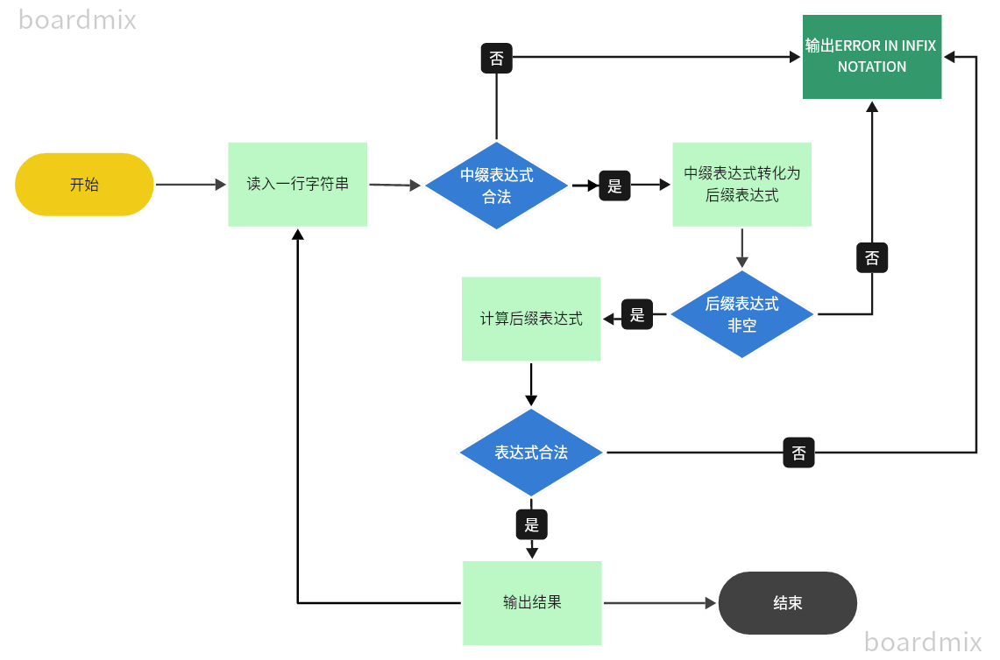

# 实验报告——表达式求值

## 一、问题重述

输入多个中缀表达式,包括`+，-，*，/，%，^`(求幂)运算，每个表达式占一行。操作数均为double类型。如果表达式正确，转化为后缀表达式并求值，保留两位小数；如果表达式非法，则输出“ERROR IN INFIX NOTATION”. 

## 二、  算法说明：

本次表达式求值主要分为三步：

1.判断中缀表达式是否合法

2.中缀表达式转化为后缀表达式

3.后缀表达式的计算

总体思路流程图：


具体所用到的算法和数据结构描述如下：

### 1.判断中缀表达式是否合法

~~~c++
bool islegal(const string& expression) {
    stack<char> st;
    for(int i=0;i<expression.length();i++) {
        char c=expression[i];
        if (c == '(') {
            st.push(c);
        } else if (c == ')') {
            if (st.empty() || st.top() != '(')
                return false;
            st.pop();
        } else if(isOperator(c)) {
            if(isOperator(expression[i+1])) return false;
        } else if(isnum(c)) {
            continue;
        } else
            return false;
    }
    return st.empty();
}
~~~


首先，我创建了一个括号栈$st$，主要用于检查括号匹配问题。

接着，遍历表达式:

若遇到左括号则入栈；

若遇到右括号，需要判断——如果栈空或栈顶是右括号则说明表达式非法，否则弹出对应的左括号；

若遇到连续两个运算符，也不符合中缀表达式的定义，非法；

若遇到数字直接跳过；

含有其他未知符号也是非法的。

最后如果栈空则说明表达式合法，栈中还有元素则非法。

其中判断是否为操作运算符和操作数的函数也都是简单易懂的：

判断是否为操作运算符：

~~~c++
bool isOperator(char c) {
    return (c == '+' || c == '-' || c == '*' || c == '/' || c == '%' || c == '^');
}
~~~

判断是否为操作数(注意由于是double类型所以把小数点也算上)：

```c++
bool isnum(char c) {
    return (c >= '0' && c <= '9') || c == '.';
}
```

这里只排除了一些常规的不合法情况，在后面还有对表达式不合法的判定。

### 2.中缀表达式转后缀表达式：

中缀表达式即大家常见的运算符位于操作数之间的表达式

$9+(3-1)*3+10÷2$

后缀表达式是借助栈将中缀表达式中的括号去掉，所有的运算符都要在操作数后面出现的表达式

$9\ 3\  1 - 3\ x + 10\ 2\ ÷\ +$

从左到右进行遍历中缀表达式。
1.遇到操作数，直接加入到后缀表达式当中。

这里使用了$stringstream$来记录生成的后缀表达式，`<sstream> `主要用来进行 **数据类型转换**，避免了缓冲区溢出的危险；而且，因为传入参数和目标对象的类型会被自动推导出来，所以不存在错误的格式化符号的问题。简单说，相比 C 编程语言库的数据类型转换，`<sstream>` 更加安全、自动和直接。

- 由于数字是连续的，对于非数字的符号我都在表达式先加入一个**空格**，与数字间**隔开**，方便之后的运算。

2.遇到（ 直接入栈，遇到 ）则依次弹出栈内运算符并加入后缀表达式，直到弹出（ 为止。【括号里的算完了】

创建一个运算符栈$operatorStack$存放运算符

3.遇到运算符。依次弹出栈中优先级高于或等于当前运算符的所有运算符，并加入后缀表达式，若碰到“(”或栈空则停止。之后再把当前运算符入栈。 【先算优先级高的，再算优先级相同但位置更靠前的，最后算当前运算符】

判断运算符优先级用到了一个小函数$getPrecedence$

**注意乘方运算的顺序**，比如$2^{2^3}$ 是先计算指数$2^3$再计算底数，即先算后面的，所以乘方运算的优先级设置为每次调用返回值递增、

```c++
int chengfang=3;
int getPrecedence(char op) {
    if (op == '+' || op == '-')
        return 1;
    if (op == '*' || op == '/' || op == '%')
        return 2;
    if (op == '^')
        return chengfang++;
    return 0;
}
```

最后将转化完的后缀表达式使用$.str()$函数转为$string$类型返回。

```c++
string infixToPostfix(const string& infix) {
    stack<char> operatorStack;
    stringstream postfix;

    for (char c : infix) {
        if (c == ' ') continue;
        if (isnum(c)) {
            postfix << c;
        } else if (isOperator(c)) {
            postfix << " ";
            while (!operatorStack.empty() && operatorStack.top() != '('
                   && getPrecedence(operatorStack.top()) >= getPrecedence(c)) {

                postfix << operatorStack.top();
                operatorStack.pop();
            }
            operatorStack.push(c);
        } else if (c == '(') {
            postfix << " ";
            operatorStack.push(c);
        } else if (c == ')') {
            postfix << " ";
            while (!operatorStack.empty() && operatorStack.top() != '(') {
                postfix << operatorStack.top();
                operatorStack.pop();
            }
            if (!operatorStack.empty() && operatorStack.top() == '(')
                operatorStack.pop();
            else
                return "";
        }
    }

    while (!operatorStack.empty()) {
        postfix << " ";
        postfix << operatorStack.top();
        operatorStack.pop();
    }
    return postfix.str();
}
```

### 3.后缀表达式计算：

创建一个运算数的栈$numStack$

遍历后缀表达式

- 如果是数字，将所有数读下来保存到$res$中， 然后通过函数$stringToDouble$将其转化为$double$类型压入栈中。

  这里起初使用$stod$函数，但一直报错，所以直接手写了$stringToDouble$，见下：

  ​	记录最终结果$result$，小数部分$decimal$，判断是否是负数$isNegative$，是否有小数部分$hasDecimal$(这里顺便判断一个小数中含有不止一个小数点的非法表达式)

  ​	整数部分每次乘10再加上该位数即可，小数部分则是记录$chushu$，因为先出现的数在十分位，要除以10，后出现的就要除以

  ​	100,1000，$chushu$依次乘10。

  ```c++
  double stringToDouble(string s) {
      double result = 0.0;
      double decimal = 0.0;
      bool isNegative = false;
      bool hasDecimal = false;
      int chushu=10;
      int i = 0;
      if (s[i] == '-') {
          isNegative = true;
          i++;
      }
      while (i < s.length()) {
          if (s[i] == '.') {
              if(hasDecimal) {
                  flag = true;
                  return 0.0;
              }
              hasDecimal = true;
              i++;
              continue;
          }
          int digit = s[i] - '0';
          if (hasDecimal) {
              decimal += (double) digit / chushu;
              chushu *= 10;
          } else {
              result = result * 10 + digit;
          }
          i++;
      }
      result += decimal;
      if (isNegative) {
          result = -result;
      }
      return result;
  }
  ```

- 如果是运算符，则取出栈顶的两个操作数进行运算操作$performOperation$

​			注意先取出来的是靠后的那个；算完的得数要再压入栈中

​			如果栈顶取不到两个操作数，说明操作数缺少，表达式不合法

​			$performOperation$函数是简单的$switch$结构，中间使用了`<cmath>`库中的fmod和pow函数进行取模运算和幂运算。

```c++
double performOperation(char op, double num1, double num2) {
    switch (op) {
        case '+':
            return num1 + num2;
        case '-':
            return num1 - num2;
        case '*':
            return num1 * num2;
        case '/':
            return num1 / num2;
        case '%':
            return fmod(num1, num2);
        case '^':
            return pow(num1, num2);
        default:
            return 0.0;
    }
}
```

如果最后栈中还有不止一个数，说明运算符缺少，表达式不合法。


## 三、  测试与结果：


|             测试输入              | 测试目的                               | 正确输出                | 实际输出                |
| :-------------------------------: | :------------------------------------- | :---------------------- | :---------------------- |
|              (2-4)^3              | 测试带括号的运算是否正确               | -8\.00                  | -8\.00                  |
|          (3\*5\*(4+8)%2)          | 测试多个运算符号之间的混合运算的正确性 | 0\.00                   | 0\.00                   |
|          5\.2\*5.8/3)+2           | 检测右括号不匹配的情况                 | ERROR IN INFIX NOTATION | ERROR IN INFIX NOTATION |
|         9\.235+3.2246/2.3         | 检测小数的运算                         | 10\.64                  | 10\.64                  |
|      5+15\*23+(235\*2+6)\*11      | 测试较大数据的计算                     | 5586\.00                | 5586\.00                |
|              2\^2\^3              | 测试多个乘方与运算的正确性；           | 256\.00                 | 256\.00                 |
|              45\#-5               | 检测非法字符                           | ERROR IN INFIX NOTATION | ERROR IN INFIX NOTATION |
|           2\*2-3+(3\*5            | 检测左括号不匹配情况                   | ERROR IN INFIX NOTATION | ERROR IN INFIX NOTATION |
|               1/2-1               | 检测运算结果为负数时的显示情况；       | -0\.50                  | -0\.50                  |
|               2/3+1               | 检测保留两位小数的正确性               | 1\.67                   | 1\.67                   |
| 3+5\*(5+2+3\*(5/5+2/(3-2)+5)%2)-2 | 检测多括号运算的正确性                 | 36\.00                  | 36\.00                  |
|             3+/2-5%3              | 检测连续出现两个运算符的错误           | ERROR IN INFIX NOTATION | ERROR IN INFIX NOTATION |
|            2\.2.2+1.1             | 检测一个小数中出现不止一个小数点的错误 | ERROR IN INFIX NOTATION | ERROR IN INFIX NOTATION |
|            (1+2)(2+1)             | 检测括号间无运算符的情况               | ERROR IN INFIX NOTATION | ERROR IN INFIX NOTATION |

已经提交oj网站并获得100分。


## 四、  分析与探讨：

#### 测试结果分析：

本次测试结果基本考虑了包括$+\ -\ *\ /\ \mod{}$乘方，括号在内全部运算符使用，从简单的测试数据到较为复杂的表达式都有相应的数据测试，对于小数，基本测试了较为简单的计算，但没有考虑对小数取模的检测，但基本的运算测试均有包含，并从测试结果中可以看到结果正确；另一方面，对于表达式中出现的非法字符，左右括号数目不匹配，计算两个数时中间出现除括号外的多个运算符，一个小数中包含不止一个小数点这四种情况，在测试数据中均体现，而且从测试结果中可以看出这些情况均算作表达式非法。

#### 问题或不足

1.无法处理操作数是负数的情况，比如-3+2应该等于-1，但会被判断为非法表达式

2.在表达式非法性的判定上有些重复的地方。

## 附录：源代码

```c++
#include <iostream>
#include <stack>
#include <string>
#include <sstream>
#include <cmath>

using namespace std;

bool flag= false;
bool isOperator(char c) {
    return (c == '+' || c == '-' || c == '*' || c == '/' || c == '%' || c == '^');
}

int chengfang=3;
int getPrecedence(char op) {
    if (op == '+' || op == '-')
        return 1;
    if (op == '*' || op == '/' || op == '%')
        return 2;
    if (op == '^')
        return chengfang++;
    return 0;
}

bool isnum(char c) {
    return (c >= '0' && c <= '9') || c == '.';
}

double performOperation(char op, double num1, double num2) {
    switch (op) {
        case '+':
            return num1 + num2;
        case '-':
            return num1 - num2;
        case '*':
            return num1 * num2;
        case '/':
            return num1 / num2;
        case '%':
            return fmod(num1, num2);
        case '^':
            return pow(num1, num2);
        default:
            return 0.0;
    }
}

bool islegal(const string& expression) {
    stack<char> st;
    for(int i=0;i<expression.length();i++) {
        char c=expression[i];
        if (c == '(') {
            st.push(c);
        } else if (c == ')') {
            if (st.empty() || st.top() != '(')
                return false;
            st.pop();
        } else if(isOperator(c)) {
            if(isOperator(expression[i+1])) return false;
        } else if(isnum(c)) {
            continue;
        } else
            return false;
    }
    return st.empty();
}

string infixToPostfix(const string& infix) {
    stack<char> operatorStack;
    stringstream postfix;

    for (char c : infix) {
        if (c == ' ') continue;
        if (isnum(c)) {
            postfix << c;
        } else if (isOperator(c)) {
            postfix << " ";
            while (!operatorStack.empty() && operatorStack.top() != '('
                   && getPrecedence(operatorStack.top()) >= getPrecedence(c)) {

                postfix << operatorStack.top();
                operatorStack.pop();
            }
            operatorStack.push(c);
        } else if (c == '(') {
            postfix << " ";
            operatorStack.push(c);
        } else if (c == ')') {
            postfix << " ";
            while (!operatorStack.empty() && operatorStack.top() != '(') {
                postfix << operatorStack.top();
                operatorStack.pop();
            }
            if (!operatorStack.empty() && operatorStack.top() == '(')
                operatorStack.pop();
            else
                return "";
        }
    }

    while (!operatorStack.empty()) {
        postfix << " ";
        postfix << operatorStack.top();
        operatorStack.pop();
    }
    return postfix.str();
}

double stringToDouble(string s) {
    double result = 0.0;
    double decimal = 0.0;
    bool isNegative = false;
    bool hasDecimal = false;
    int chushu=10;
    int i = 0;
    if (s[i] == '-') {
        isNegative = true;
        i++;
    }
    while (i < s.length()) {
        if (s[i] == '.') {
            if(hasDecimal) {
                flag= true;
                return 0.0;
            }
            hasDecimal = true;
            i++;
            continue;
        }
        int digit = s[i] - '0';
        if (hasDecimal) {
            decimal += (double) digit / chushu;
            chushu *= 10;
        } else {
            result = result * 10 + digit;
        }
        i++;
    }
    result += decimal;
    if (isNegative) {
        result = -result;
    }
    return result;
}

double calculate(const string& postfix) {
    stack<double> numStack;

    for(int i=0;i<postfix.length();i++) {
        if(postfix[i]==' ') continue;
        if (isOperator(postfix[i])) {
            if (numStack.size() < 2) {
                flag= true;
                return 0.0;
            }
            double num2 = numStack.top();
            numStack.pop();
            double num1 = numStack.top();
            numStack.pop();

            double result = performOperation(postfix[i], num1, num2);
            numStack.push(result);
        } else {
            string res;
            while(isnum(postfix[i])) {
                res+=postfix[i];
                i++;
            }
            numStack.push(stringToDouble(res));
            i--;
        }
    }

    if (numStack.size() == 1) return numStack.top();
    else {
        flag= true;
        return 0;
    }
}

int main() {
    string expression;

    while (getline(cin, expression)) {
        if (!islegal(expression)) {
            cout << "ERROR IN INFIX NOTATION" << endl;
            continue;
        }

        string postfix = infixToPostfix(expression);
        if (postfix.empty()) {
            cout << "ERROR IN INFIX NOTATION" << endl;
            continue;
        }
        double result = calculate(postfix);
        if(flag) {
            cout << "ERROR IN INFIX NOTATION" << endl;
            continue;
        }
//        cout << "Postfix: " << postfix << endl;
        printf("%.2lf\n",result);
    }

    return 0;
}
```
