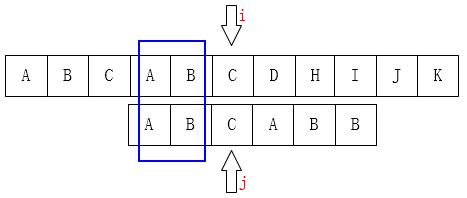

自己题解写到最后才搜到这个……但码风我也看不懂，留给后人借鉴吧
[数据结构题目汇总-CSDN博客](https://blog.csdn.net/weixin_56944155/article/details/121942935)
## 1、线性表
### [1.1 基数排序]([学生端](http://10.134.1.2/nkuoj/#/problem/51623))

```cpp fold
#include <iostream>

using namespace std;
const int N = 1e5;

//求最大位数
int maxbit(int x) {
    int count = 0;
    while (x) {
        count++;
        x /= 10;
    }
    return count;
}

int cnt[20];
int n, a[N], mx = 0;
int tmp[N];

int main() {

    cin >> n;
    for (int i = 1; i <= n; i++) {
        cin >> a[i];
        mx = max(mx, a[i]);
    }
    int d = maxbit(mx);//最高位位数
    int mo = 1;
    for (int i = 1; i <= d; i++) {
        for (int j = 0; j < 10; j++)
            cnt[j] = 0;//清空
        for (int j = 1, k; j <= n; j++) {
            k = (a[j] / mo) % 10;
            cnt[k]++;
        }
        for (int j = 1; j < 10; j++)
            cnt[j] += cnt[j - 1];

        for (int k, j = n; j > 0; j--) {
            k = (a[j] / mo) % 10;
            tmp[cnt[k]] = a[j];
            cnt[k]--;
        }
        for (int j = 1; j < n; j++) {
            a[j] = tmp[j];
            cout << a[j] << " ";
        }
        a[n] = tmp[n];
        printf("%d\n", a[n]);
        mo *= 10;
    }

    return 0;
}
```

### [1.2 有序线性表合并]([学生端](http://10.134.1.2/nkuoj/#/problem/53601))


```cpp fold
#include <iostream>

using namespace std;
const int N = 1e5;
int m, n;
int a[N], b[N];

int main() {
    cin >> n >> m;
    for (int i = 1; i <= n; i++)
        cin >> a[i];
    for (int i = 1; i <= m; i++)
        cin >> b[i];
    int pa = 1, pb = 1;
    cout << (a[pa] > b[pb] ? b[pb++] : a[pa++]);
    while (pa <= n || pb <= m) {
        if (pa <= n && pb <= m)
            cout << " " << (a[pa] > b[pb] ? b[pb++] : a[pa++]);
        while (pa > n && pb <= m) {
            cout << " " << b[pb++];
        }
        while (pb > m && pa <= n) {
            cout << " " << a[pa++];
        }
    }
    return 0;
}
```

### [1.3 约瑟夫环](http://10.134.1.2/nkuoj/#/problem/52048)

```c fold
#include <iostream>
using namespace std;
const int N = 1e5;
int n, k;
int cnt;//已经出列了几个
int hd[N], tl[N];
int main() {
    cin >> n >> k;
    cnt = 0;
    for (int i = 1; i <= n; i++)
        hd[i] = i - 1, tl[i] = i + 1;
    hd[1] = n;
    tl[n] = 1;
    int p = 1, k_cnt = 1;//当前指针&数到几了
    bool flag = 0;
    while (cnt < n) {
        while (k_cnt < k) {
            k_cnt++;
            p = tl[p];
        }
        if (flag) cout << "->";
        flag = 1;
        cout << p;
        tl[hd[p]] = tl[p];
        hd[tl[p]] = hd[p];
        p = tl[p];
        k_cnt = 1;
        cnt++;
    }

    return 0;
}
```

##   2、栈
### [互斥字符串](http://10.134.1.2/nkuoj/#/problem/4574)
易错点：

最后出栈时顺序是反的，用个数组接受一下再反着输出就好了

```c fold
#include <cstring>
#include <iostream>
#include <stack>
using namespace std;
const int N = 1e5;
char t[N];
int main() {
    stack<char> s;
    cin >> t;
    int n = strlen(t);
    for (int i = 0; i < n; i++) {
        if (s.empty()) {
            s.push(t[i]);
            continue;
        } else {
            char a = s.top();
            if (a - t[i] == 32 || t[i] - a == 32) {
                s.pop();
                continue;
            } else
                s.push(t[i]);
        }
    }
    if (s.empty()) cout << "-1";
    else {
        int m = 0;
        char ans[N];
        while (!s.empty()) {
            m++;
            ans[m] = s.top();
            s.pop();
        }
        for (int i = m; i > 0; i--)
            cout << ans[i];
    }
    return 0;
}
```

### [linux路径](http://10.134.1.2/nkuoj/#/problem/4462)
很好理解的
```c fold
#include <cmath>
#include <cstring>
#include <iomanip>
#include <iostream>
#include <stack>
#include <string>
using namespace std;

int main() {
    stack<string> st;//只存目录名
    string a;
    cin >> a;
    int len = a.length();
    int j;
    for (int i = 0; i < len; i++) {
        if (a[i] == '/') {
            continue;
        } else {
            // . 的情况
            if (a[i] == '.' && (i == len - 1 || a[i + 1] != '.')) 
                continue;
            // 
            if (a[i] == '.' && i < len - 1 && a[i + 1] == '.') {
                if(!st.empty()) st.pop();
                i++;
                continue;
            }
            //目录名的情况
            string b = "";
            b = b + a[i];
            if (i == len - 1) {
                st.push(b);
            } else {
                j = i + 1;
                while (j < len && a[j] != '/' && a[j] != '.') 
                    b = b + a[j++];
                i = j;
                st.push(b);
            }
        }
    }
    if (st.empty()) {
        cout << '/';
    } else {
        cout << '/';
        stack<string> st1;//反着输出
        while (!st.empty()) {
            st1.push(st.top());
            st.pop();
        }
        while (!st1.empty()) {
            if (st1.size() == 1) {
                cout << st1.top();
                st1.pop();
                continue;
            }
            cout << st1.top() << '/';
            st1.pop();
        }
    }
    return 0;
}
```

chat的
```c fold
#include <algorithm>
#include <iostream>
#include <stack>
#include <string>
using namespace std;
int main() {
    string path;
    cin >> path;
    path += "/";
    stack<string> st;
    string tmp;
    for (auto c: path) {
        if (c == '/') {
            if (tmp == ".." && !st.empty())
                st.pop();
            else if (tmp != ".." && tmp != "." && !tmp.empty()) {
                st.push(string(tmp.rbegin(), tmp.rend()));
                //注意因为是正序遍历，我们倒序入栈才能使答案正过来
            }
            tmp.clear();//注意清空
        } else
            tmp += c;
    }
    string ans;
    while (!st.empty()) {
        string t = st.top();
        st.pop();
        ans += t + "/";
    }
    reverse(ans.begin(), ans.end());
    if (ans.empty()) ans = "/";
    cout << ans;
    return 0;
}
```

##   3、队列
### [二元一次多项式求幂](http://10.134.1.2/nkuoj/#/problem/4004)
emm根本没用到队列，直接模拟就过了，用到的公式

$(ax+by)^n=\sum_{k=0}^n{n\choose k}(ax)^{n-k}(by)^k$

然后预处理一下组合数啥的就行了

输出的时候注意亿些细节

第一次得了80爆int了

```cpp fold
//二元一次多项式求幂
//第一次得了80爆int了
#include <iostream>

using namespace std;
long long c[10][10];

void print(int x_mi, int y_mi, long long i, bool &flag) {

    if (y_mi > 0 && i > 0 && flag) printf("+");
    if (i != 1) {
        if (i == -1) printf("-");
        else
            printf("%lld", i);
    }
    if (x_mi) {
        if (x_mi == 1) printf("x");
        else
            printf("x^%d", x_mi);
    }
    if (y_mi) {
        if (y_mi == 1) printf("y");
        else
            printf("y^%d", y_mi);
    }
    flag = true;
}
int main() {

    // c[n][m]预处理组合数
    int a, b, n;
    cin >> a >> b >> n;
    long long a_mi[10], b_mi[10];
    a_mi[0] = 1;
    b_mi[0] = 1;
    for (int i = 1; i <= 6; i++) {
        a_mi[i] = a_mi[i - 1] * a;
        b_mi[i] = b_mi[i - 1] * b;
    }
    for (int i = 0; i < 7; i++) {
        for (int j = 0; j <= i; j++) {
            if (!j) c[i][j] = 1;
            else
                c[i][j] = c[i - 1][j - 1] + c[i - 1][j];
        }
    }
    bool flag = false;
    for (int k = 0; k <= n; k++) {
        long long i = c[n][k] * a_mi[n - k] * b_mi[k];//系数
        if (i) print(n - k, k, i, flag);
    }
    return 0;
}
```

#### 高精度版

直接封装个模版套上前面写的就得了50分

不知为啥，对拍拍了半天没找到不同

先搁置吧

```c++ fold
# include <cstdio>
# include <iostream>
# include <cstring>
# include <algorithm>
# include <cmath>

using namespace std;

# define FOR(i, a, b) for(int i = a; i <= b; i++)
# define _FOR(i, a, b) for(int i = a; i >= b; i--)

struct Bigint
{
    static const int M = 1000;
    int num[M + 10], len;

    Bigint() { clean(); }

    void clean(){
        memset(num, 0, sizeof(num));
        len = 1;
    }

    void read(){
        char str[M + 10];
        scanf("%s", str);
        len = strlen(str);
        FOR(i, 1, len)
            num[i] = str[len - i] - '0';
    }

    void write(){
        _FOR(i, len, 1)
            printf("%d", num[i]);
    }

    void itoBig(int x){
        clean();
        while(x != 0){
            num[len++] = x % 10;
            x /= 10;
        }
        if(len != 1) len--;
    }

    bool operator < (const Bigint &cmp) const {
        if(len != cmp.len) return len < cmp.len;
        _FOR(i, len, 1)
            if(num[i] != cmp.num[i]) return num[i] < cmp.num[i];
        return false;
    }

    bool operator > (const Bigint &cmp) const { return cmp < *this; }
    bool operator <= (const Bigint &cmp) const { return !(cmp < *this); }
    bool operator != (const Bigint &cmp) const { return cmp < *this || *this < cmp; }
    bool operator == (const Bigint &cmp) const { return !(cmp < *this || *this < cmp); }

    Bigint operator + (const Bigint &A) const {
        Bigint S;
        S.len = max(len, A.len);
        FOR(i, 1, S.len){
            S.num[i] += num[i] + A.num[i];
            if(S.num[i] >= 10){
                S.num[i] -= 10;
                S.num[i + 1]++;
            }
        }
        while(S.num[S.len + 1]) S.len++;
        return S;
    }

    Bigint operator - (const Bigint &A) const {
        Bigint S;
        S.len = max(len, A.len);
        FOR(i, 1, S.len){
            S.num[i] += num[i] - A.num[i];
            if(S.num[i] < 0){
                S.num[i] += 10;
                S.num[i + 1]--;
            }
        }
        while(!S.num[S.len] && S.len > 1) S.len--;
        return S;
    }

    Bigint operator * (const Bigint &A) const {
        Bigint S;
        if((A.len == 1 && A.num[1] == 0) || (len == 1 && num[1] == 0)) return S;
        S.len = A.len + len - 1;
        FOR(i, 1, len)
            FOR(j, 1, A.len){
                S.num[i + j - 1] += num[i] * A.num[j];
                S.num[i + j] += S.num[i + j - 1] / 10;
                S.num[i + j - 1] %= 10;
            }
        while(S.num[S.len + 1]) S.len++;
        return S;
    }

    Bigint operator / (const Bigint &A) const {
        Bigint S;
        if((A.len == 1 && A.num[1] == 0) || (len == 1 && num[1] == 0)) return S;
        Bigint R, N;
        S.len = 0;
        _FOR(i, len, 1){
            N.itoBig(10);
            R = R * N;
            N.itoBig(num[i]);
            R = R + N;
            int flag = -1;
            FOR(j, 1, 10){
                N.itoBig(j);
                if(N * A > R){
                    flag = j - 1;
                    break;
                }
            }
            S.num[++S.len] = flag;
            N.itoBig(flag);
            R = R - N * A;
        }
        FOR(i, 1, S.len / 2) swap(S.num[i], S.num[len - i + 1]);
        while(!S.num[S.len] && S.len > 1) S.len--;
        return S;
    }

    Bigint operator % (const Bigint &A) const {
        Bigint S;
        Bigint P = *this / A;
        S = *this - P * A;
        return S;
    }
};
Bigint zero;
Bigint one;
Bigint minusone;
void print(int x_mi, int y_mi, Bigint i, bool &flag) {

    if (y_mi > 0 && i > zero && flag) printf("+");
    if (i != one) {
        if (i == minusone) printf("-");
        else i.write();
    }
    if (x_mi) {
        if (x_mi == 1) printf("x");
        else printf("x^%d", x_mi);
    }
    if (y_mi) {
        if (y_mi == 1) printf("y");
        else printf("y^%d", y_mi);
    }
    flag = true;
}
int main()
{
    Bigint a,b;
    a.read();
    b.read();
    int n;
    cin>>n;
    Bigint a_mi[21], b_mi[21];
    a_mi[0].itoBig(1);
    b_mi[0].itoBig(1);
    Bigint c[21][21];
    for (int i = 0; i <= 20; i++) {
        for (int j = 0; j <= i; j++) {
            if (!j) c[i][j].itoBig(1);
            else c[i][j] = c[i - 1][j - 1] + c[i - 1][j];
        }
    }
    for (int i = 1; i <= 20; i++) {
        a_mi[i] = a_mi[i - 1] * a;
        b_mi[i] = b_mi[i - 1] * b;
    }
    bool flag = false;

    zero.itoBig(0);
    one.itoBig(1);
    minusone.itoBig(-1);
    for (int k = 0; k <= n; k++) {
        Bigint i = c[n][k] * a_mi[n - k] * b_mi[k];//系数
        if (i!=zero) print(n - k, k, i, flag);
    }
    return 0;
}

```

正确答案（网上copy的）

```c++ fold
#include<iostream>
#include<queue>
#include<string>
#include<string.h>
using namespace std;

//将数字的非符号部分存入字符串
string getNum(const string& s) {
    int t = s.size();
    string str = "";
    if (s[0] == '-')
    {
        for (int i = 1; i < s.size(); i++)
            str += s[i];
    }
    else
    {
        for (int i = 0; i < s.size(); i++)
            str += s[i];
    }
    return str;
}

//乘法，逐位计算，将结果存入数组再转为字符串
string multi(const string& a, const string& b)
{
    int len1, len2;
    int isNeg = 0;
    if (((a[0] == '-' && b[0] != '-') || (a[0] != '-' && b[0] == '-')) && (a != "0" && b != "0")) isNeg = 1;
    string num1 = getNum(a);
    string num2 = getNum(b);
    len1 = num1.size();
    len2 = num2.size();

    int* res = new int[len1 + len2];
    memset(res, 0, sizeof(int) * (len1 + len2));


    for (int i = len1 - 1; i >= 0; --i)
    {
        for (int j = len2 - 1; j >= 0; --j) {
            res[i + j + 1] += (num1[i] - '0') * (num2[j] - '0');
        }
    }
    for (int i = len1 + len2 - 1; i >= 0; --i)
    {
        if (res[i] >= 10) {
            res[i - 1] += res[i] / 10;
            res[i] %= 10;
        }
    }
    string ans = "";
    for (int i = 0; i < len1 + len2; ++i) ans += res[i] + '0';
    if (isNeg) ans = '-' + ans;
    return ans;
}

//加法
string plusNum(const string& num1, const string& num2)
{
    int len1 = num1.size(), len2 = num2.size();
    int len = max(len1, len2) + 1;
    int length = len;
    string ans = "";
    int* res = new int[length];
    memset(res, 0, sizeof(int) * length);

    while (len1 > 0 && len2 > 0)
    {
        res[len - 1] = (num1[len1 - 1] - '0') + (num2[len2 - 1] - '0');
        len1--;
        len2--;
        len--;
    }
    while (len1 > 0)
    {
        res[len - 1] = (num1[len1 - 1] - '0');
        len1--;
        len--;
    }
    while (len2 > 0)
    {
        res[len - 1] = (num2[len2 - 1] - '0');
        len2--;
        len--;
    }
    for (int i = length - 1; i >= 0; --i)
    {
        if (res[i] >= 10)
        {
            res[i - 1] += res[i] / 10;
            res[i] %= 10;
        }
    }

    int k;
    for (k = 0; k < length; k++)
        if (res[k] != 0)break;
    if (k == length)ans = "0";
    else
    {
        for (int i = k; i < length; i++)
            ans += res[i] + '0';
    }
    return ans;
}

//减法
string minusNum(string& num1, string& num2)
{
    int len1 = num1.size();
    int len2 = num2.size();
    int len;
    if (len1 >= len2)
    {
        for (int i = 1; i <= len1 - len2; i++)
            num2 = '0' + num2;
        len = len1;
    }
    if (len2 > len1)
    {
        for (int i = 1; i <= len2 - len1; i++)
            num1 = '0' + num1;
        len = len2;
    }

    int* num_a = new int[len];
    int* num_b = new int[len];
    for (int i = 0; i < len; ++i)
    {
        num_a[i] = num1[i] - '0';
        num_b[i] = num2[i] - '0';
    }
    int q = 0;//记录退位
    for (int i = len - 1; i >= 0; --i)
    {
        num_a[i] -= q;
        if (num_a[i] < num_b[i]) {
            num_a[i] += 10;
            q = 1;
        }
        num_b[i] = num_a[i] - num_b[i];
    }

    int k;
    string ans = "";
    for (k = 0; k < len; k++)
        if (num_b[k] != 0)break;
    if (k == len)ans = "0";
    else
    {
        for (int i = k; i < len; i++)
            ans += num_b[i] + '0';
    }
    return ans;
}

//判断两数相减结果是否为非负
bool isPos(const string&str1, const string str2)
{
    if (str1.size() > str2.size())
        return true;
    if (str1.size() == str2.size())
        return str1 > str2;
    return false;
}

//计算系数
void powerFun(queue<string>& q, int n, const string& a, const string& b)
{
    string t = "0";
    string s;
    string num1, num2;
    string ans;
    for (int i = 2; i <= n; i++)
    {
        q.push(to_string(0));
        for (int j = 1; j <= i + 1; j++)
        {
            s = q.front();
            q.pop();

            num1 = multi(t, b);
            num2 = multi(s, a);
            if (num1[0] != '-' && num2[0] != '-')
                ans = plusNum(num1, num2);
            else if (num1[0] == '-' && num2[0] == '-')
            {
                ans = plusNum(getNum(num1), getNum(num2));
                ans = '-' + ans;
            }
            if (num1[0] == '-' && num2[0] != '-')
            {
                num1 = getNum(num1);
                if (isPos(num2, num1))
                {
                    ans = minusNum(num2, num1);
                }
                else
                {
                    ans = '-' + minusNum(num1, num2);
                }
            }
            if (num1[0] != '-' && num2[0] == '-')
            {
                num2 = getNum(num2);
                if (isPos(num1, num2))
                {
                    ans = minusNum(num1, num2);
                }
                else
                {
                    ans = '-' + minusNum(num2, num1);
                }
            }
            q.push(ans);
            t = s;
        }
    }
}

//表达式输出处理
void showRes(queue<string>& q, int n)
{
    int k = n;
    int flag = 1;
    while (!q.empty())
    {
        if (q.front() == "0" )
        {
            q.pop();
            k--;
            flag = 0;
            continue;
        }
        else if (q.front() == "1")
        {
            if (flag != 0 && k < n)cout << '+';
            flag = 1;
        }
        else if (q.front()[0] != '-')
        {
            if (k < n)cout << '+';
            cout << q.front();
        }
        else if (q.front() == "-1") cout << '-';
        else if (q.front()[0] == '-') cout << q.front();

        if (k == 1) cout << 'x';
        else if (k != 0) cout << "x^" << k;
        if (k == n - 1) cout << 'y';
        else if (k != n) cout << "y^" << n - k;

        q.pop();
        k--;
    }
    cout << endl;
}


int main()
{
    int a, b, n;
    cin >> a >> b >> n;
    queue<string>q;
    string str1 = to_string(a);
    string str2 = to_string(b);
    q.push(str1);
    q.push(str2);
    powerFun(q, n, str1, str2);
    showRes(q, n);
    return 0;
}

```

## 表达式求值
实验报告_表达式求值

# 4、字符串
## [字符串应用-实现KMP匹配算法](http://10.134.1.2/nkuoj/#/problem/170980)

字符串A是否为字符串B的子串?如果是的话出现在B的哪些位置?

字符串A称为**模式串**$pattern$，字符串B称为**主串**$target$(T)。

### Brute-Force算法
暴力
假设n为主串长度，m为模式串长度。每一轮字符串比较：最差的情况为模式串最后一个字与主串不同，其他都相同（如模式串为AAB，主串对应部分为AAC），必须走完整个字符串才能得出结果，因此复杂度为$O(m)$。所有轮字符串比较：最差的情况是移动到最后一次比较才寻找得到，总共需要n-m+1次，主串通常比模式串长很多，故时间复杂度为$O(nm)$

### KMP算法

字符串下标从0开始，$i$是主串指针，$j$模式串指针，P[]模式串，T[]主串

例如到此处匹配失败


设$j$下一次移到$k$

$i$可以不回溯，因为知道之前的都是匹配的$T[i-j,i-1]=P[0,j-1]$，（包含$T[i-k , i-1]=P[j-k,j-1]$)

由于$P[0,k-1]=P[j-k,j-1]$，则有$P[0 , k-1] = T[i-k , i-1]$




该规律是KMP算法的关键，KMP算法是利用**模式串自身的这种性质**（如图两端重复的蓝色），来提高匹配速度

该性质在许多其他中版本的解释中还可以描述成：若子串的前缀集和后缀集 中，重复的最长子串的长度为k，则下次匹配子串的j可以移动到第k位(下标为0为第0位)。我们将这个解释定义成**最长公共前后缀解释。**

这里面的前缀集表示除去 最后一个字符 后，前面的所有子串集合，后缀集指的的是除去 第一个字符 后，后面的所有子串组成的集合。举例说明如下：

在“ababa”中，前缀集是{a,ab,aba,abab}，后缀集是{a,ba,aba,baba}，二者最长重复子串是aba，k=3；

在“abcabcdabc”中，前缀集是{a,ab,abc,abca,abcab,abcabc,abcabcd,abcabcda,abcabcdab}，后缀集是{c,bc,abc,dabc,cdabc,bcdabc,abcdabc,cabcdabc,bcabcdabc}，二者最长重复的子串是“abc”,k=3； 


为什么去前缀的最后一个字符和后缀的第一个字符？ 因为整个肯定是自己等于自己的，这样移动到后缀的开始位置不就是把$j$移到最开始重新再来吗……

为什么要找公共前后缀呢？因为这些是一样的，不用再重复比较了。

为什么要最长呢？也是因为不用再重复比较了

理解1：把模式串**移动**到**最长相等前后缀**的后缀的开始位置（所对应的主串位置）即可。

这个模式串整体的移动 代码不好实现……所以看一下理解2

**理解2**：$j$移动到从最长相等前后缀的前缀的下一位，继续比较$T[i]$与$P[j]$

[帮你把KMP算法学个通透！（求next数组代码篇）_哔哩哔哩_bilibili](https://www.bilibili.com/video/BV1M5411j7Xx/?p=22&spm_id_from=pageDriver&vd_source=50f71b6f0ea6d5115ac14c7af4277547)

$Next[]$就记录模式串每一位不匹配时$j$要回溯到哪个位置。

求Next的时间复杂度为$O(m)$
匹配字符串的复杂度为$O(n)$
总体时间复杂度为$O(m+n)$

#### 代码实现
```c fold
#include <iostream>  
  
#define N 10005  
  
using namespace std;  
int Next[N];  
  
void getnext(string p) {  
    int i, j = 0;  
    Next[0] = 0;  
    for (i = 1; i < p.length(); i++) {  
        while (p[i] != p[j] && j > 0)  
            j = Next[j - 1];  
        if (p[i] == p[j])  
            Next[i] = ++j;  
    }  
}  
void kmp(string t, string p) {  
    getnext(p);  
    for (int i = 0, j = 0; i < t.length(); i++) {  
        while (t[i] != p[j] && j > 0)  
            j = Next[j - 1];  
        if (t[i] == p[j]) j++;  
        if (j == p.length()) {  
            printf("%d", i - j + 1);  
            return;  
        }  
    }  
    printf("no");  
}  
  
int main() {  
    string pattern, s;  
    cin >> s;  
    cin >> pattern;  
  
    kmp(s, pattern);  
    return 0;  
}
```


**牢记**：**$next[j]$的值（也就是$k$）表示，当$P[j] != T[i]$时，$j$指针的下一步移动位置。


1.当$P[k] == P[j]$时，有$next[j+1] == next[j] + 1$

因为在$P[j]$之前已经有$P[0 , k-1] = p[j-k , j-1]$。（$next[j] =k$）

这时候现有$P[k] == P[j]$，我们是不是可以得到$P[0,k-1] + P[k] = P[j-k , j-1] + P[j]$。

即：$P[0 , k] = P[j-k , j]$，即$next[j+1] = k + 1 =next[j] + 1$。


2.如果$P[k] != P[j]$，如上图，我们已经不可能找到$[ A，B，A，B ]$这个最长的后缀串了，但我们还是可能找到$[ A，B ]$、$[ B ]$这样的前缀串


$P[i] != P[j]$找最长公共前后缀，$j$移到后缀开头

### BM算法
https://www.bilibili.com/video/BV1j4411o7X3/?spm_id_from=333.337.search-card.all.click&vd_source=50f71b6f0ea6d5115ac14c7af4277547

坏字符规则：**从右往左**匹配，找到主串中第一个不匹配的字符(坏字符)，模式串指针继续往前（模式串右移），直到找到和坏字符一样的字符，如果找到了，模式串移到该坏字符处（让这个对齐主串刚才没匹配上的位置）；如果没有，则直接把模式串第一个对齐主串该坏字符的下一位，最右出现位置为-1

好后缀规则：**从右往左**匹配，找到坏字符（意味着该坏字符后面的串是匹配的，即为好后缀），往左寻找模式串中是否还有该**好后缀**。当字符失配时，后移位数 = 好后缀在模式串中的位置 - 好后缀在模式串上一次出现的位置，且如果好后缀在模式串中没有再次出现，则为-1

```text
   1. 找出好后缀的所有后缀子串 
   2. 找出模式串的所有前缀子串
   3. 找到好后缀中最长的能和模式串的前缀子串匹配的后缀子串
   
注意：好后缀的后缀子串，本身也是模式串的后缀子串，所以我们可以利用这个在模式串中找到另外的对应匹配的字符
```

两种规则综合使用，哪种移动的位数多使用哪种
时间复杂度：$O(n/m)$,最坏$O(m*n)$

为什么要倒着匹配？
	提高匹配效率：从右向左匹配可以有效地避免在匹配过程中反复比较同一个字符，从而提高匹配的效率。


```c fold
#include <iostream>  
#include <string>  
#include <vector>  
  
using namespace std;  
  
bool isPrefix(const string &pattern, int pos) {  
    unsigned int plen = pattern.length();  
    for (int i = pos, j = 0; i < plen; i++, j++) {  
        if (pattern[i] != pattern[j]) {  
            return false;  
        }  
    }  
    return true;  
}  
//好后缀匹配  
int suffixLength(const string &pattern, int pos) {  
    int pLen = pattern.length();  
    int len = 0;  
    for (int i = pos, j = pLen - 1; i >= 0 && pattern[i] == pattern[j]; i--, j--) {  
        len += 1;  
    }  
    return len;  
}  
  
int fun(const string &pattern, const string &target) {  
    int tLen = target.length();  
    int pLen = pattern.length();  
    if (pLen > tLen) {  
        return -1;  
    }  
    vector<int> bad_table(256, pLen);// 记录坏字符出现时，应该跳过的字符数，256是字符集字符数  
    vector<int> good_table(pLen, 0);// 获得好后缀数值的数组  
    for (int i = 0; i < pLen - 1; i++)  
        bad_table[pattern[i]] = pLen - 1 - i;  
  
    int lastPrefixPosition = pLen;//找到该位置后最长的能和模式串的前缀子串匹配的后缀子串,找不到先默认为plen  
    for (int i = pLen - 1; i >= 0; i--) {  
        if (isPrefix(pattern, i + 1)) {  
            lastPrefixPosition = i + 1;  
        }  
        good_table[pLen - 1 - i] = lastPrefixPosition - i + pLen - 1;//pLen-1-i是0~plen-1  
    }  
    for (int i = 0; i < pLen - 1; i++) {  
        int slen = suffixLength(pattern, i);  
        good_table[slen] = pLen - 1 - i + slen;  
    }  
    //从右往左比，i是主串指针,j模式串指针  
    for (int i = pLen - 1, j; i < tLen;) {  
        for (j = pLen - 1; target[i] == pattern[j]; i--, j--) {  
            if (j == 0)  
                return i;  
        }  
        i += max(good_table[pLen - j - 1], bad_table[target[i]]);  
    }  
    return -1;  
}  
  
int main() {  
    string pattern, target;  
    cin >> target >> pattern;  
    int ans = fun(pattern, target);  
    if (ans == -1) printf("no");  
    else printf("%d", ans);  
    return 0;  
}
```

# 5、矩阵
## [旋转矩阵](http://10.134.1.2/nkuoj/#/problem/22792)
以顺、逆时针交替的方式打印出矩阵的每个元素
我是用笨办法

```c fold
#include <iostream>  
  
using namespace std;  
int g[101][101];  
bool row_flag[101], column_flag[101];  
int n, m;  
  
void print_rows(int row, int head, int tail, bool minus) {  
    if (head > tail || row_flag[row] || head <= 0 || tail > m) return;  
    switch (minus) {  
        case true:  
            for (int i = tail; i >= head; i--)  
                printf("%d ", g[row][i]);  
            break;  
        case false:  
            for (int i = head; i <= tail; i++)  
                printf("%d ", g[row][i]);  
            break;  
    }  
    row_flag[row] = 1;  
}  
  
void print_columns(int column, int head, int tail, bool minus) {  
    if (head > tail || column_flag[column] || head <= 0 || tail > n) return;  
    switch (minus) {  
        case true:  
            for (int i = tail; i >= head; i--)  
                printf("%d ", g[i][column]);  
            break;  
        case false:  
            for (int i = head; i <= tail; i++)  
                printf("%d ", g[i][column]);  
            break;  
    }  
    column_flag[column] = true;  
}  
  
  
int main() {  
  
    cin >> n >> m;  
    for (int i = 1; i <= n; i++)  
        for (int j = 1; j <= m; j++)  
            cin >> g[i][j];  
    int up, down;  
    int left = 0, right;  
    bool minus = true;  
    for (int i = 1; i <= (n + 1) / 2; i++) {  
        up = i;  
        down = n - i + 1;  
        left++;  
        right = m - left + 1;  
        if (i % 2 == 1) {  
            print_rows(up, left, right, !minus);  
            print_columns(right, up + 1, down - 1, !minus);  
            print_rows(down, left, right, minus);  
            print_columns(left, up + 1, down - 1, minus);  
        } else {  
            print_columns(left, up, down, !minus);  
            print_rows(down, left + 1, right - 1, !minus);  
            print_columns(right, up, down, minus);  
            print_rows(up, left + 1, right - 1, minus);  
        }  
        if(left>=right) break;  
    }  
  
    return 0;  
}
```

## [三元组表示的稀疏矩阵的乘法运算](http://10.134.1.2/nkuoj/#/problem/185355)

```c fold
#include<iostream>  
#include<cstdio>  
#include<cstring>  
#include<algorithm>  
  
using namespace std;  
const int N = 1000;  
  
struct Triple {  
    int x, y, v;  
//    bool operator<(const Triple &p) {  
//        return x < p.x;  
//    }  
};//三元组  
  
typedef struct {  
    int m, n, cnt;//行列，非0元个数  
    Triple data[N];  
    int fir[N];//每行第一个非0元在三元组中的位置  
} matrix;  
  
int num[N];//该行有多少个非零元  
int ans[N];  
  
int main() {  
    matrix A, B, C;  
    scanf("%d %d %d", &A.m, &A.n, &A.cnt);  
    for (int i = 1; i <= A.cnt; i++)  
        scanf("%d %d %d", &A.data[i].x, &A.data[i].y, &A.data[i].v);  
    scanf("%d %d %d", &B.m, &B.n, &B.cnt);  
    for (int i = 1; i <= B.cnt; i++)  
        scanf("%d %d %d", &B.data[i].x, &B.data[i].y, &B.data[i].v);  
    if (A.n != B.m) {  
        printf("ERROR");  
        return 0;  
    }  
    C.m = A.m;  
    C.n = B.n;  
    C.cnt = 0;  
//    sort(A.data + 1, A.data + 1 + A.cnt);  
//    sort(B.data + 1, B.data + 1 + B.cnt);  
    for (int i = 1; i <= A.m; i++)  
        num[i] = 0;  
    for (int i = 1; i <= A.cnt; i++)  
        num[A.data[i].x]++;  
    A.fir[1] = 1;  
    for (int i = 2; i <= A.m; i++)  
        A.fir[i] = A.fir[i - 1] + num[i - 1];
          
    for (int i = 1; i <= B.m; i++)  
        num[i] = 0;  
    for (int i = 1; i <= B.cnt; i++)  
        num[B.data[i].x]++;  
    B.fir[1] = 1;  
    for (int i = 2; i <= B.m; i++)  
        B.fir[i] = B.fir[i - 1] + num[i - 1];  
  
    if (A.cnt * B.cnt) {  
        for (int row = 1; row <= A.m; row++) {  
            memset(ans, 0, sizeof(ans));  
            C.fir[row] = C.cnt + 1;  
            int end1, end2;  //end2 B有贡献位置
            if (row < A.m)  
                end1 = A.fir[row + 1];  
            else  
                end1 = A.cnt + 1;  
            for (int i = A.fir[row]; i < end1; i++) {//遍历属于这一行的所有三元组  
                if (A.data[i].y < B.m)//  
                    end2 = B.fir[A.data[i].y + 1];  
                else  
                    end2 = B.cnt + 1;  
                for (int j = B.fir[A.data[i].y]; j < end2; j++)  
                    ans[B.data[j].y] += A.data[i].v * B.data[j].v;//计算矩阵乘法  
            }  
            for (int col = 1; col <= C.n; col++) {  
                if (ans[col]) {  
                    C.cnt++;  
                    C.data[C.cnt].x = row;  
                    C.data[C.cnt].y = col;  
                    C.data[C.cnt].v = ans[col];  
                }  
            }  
        }  
    } else {  
        printf("The answer is a Zero Matrix");  
    }  
    if (C.cnt) {  
        for (int i = 1; i <= C.cnt; i++)  
            printf("%d %d %d\n", C.data[i].x, C.data[i].y, C.data[i].v);  
    } else {  
        printf("The answer is a Zero Matrix");  
    }  
    return 0;  
}
```

## 判断布尔矩阵的奇偶性
很简单的一道
```c fold
#include<iostream>  
#include<cstdio>  
#define uint unsigned int  
using namespace std;  
const int N = 105;  
  
bool a[N][N];  
uint row,col;  
uint row_cnt,col_cnt;  
  
int main() {  
    int n;  
    cin>>n;  
    for(uint i=1;i<=n;i++) {  
        int cnt=0;  
        for(uint j=1;j<=n;j++) {  
            cin>>a[i][j];  
            if(a[i][j])  
                cnt++;  
        }  
        if(cnt%2) {  
           row_cnt++;  
           row=i;  
        }  
    }  
    for(uint i=1;i<=n;i++) {  
        int cnt=0;  
        for(uint j=1;j<=n;j++) {  
            if(a[j][i]) cnt++;  
        }  
        if(cnt%2) {  
            col_cnt++;  
            col=i;  
        }  
    }  
    if(!col_cnt && !row_cnt) {  
        printf("OK");  
    }else if(col_cnt==1 && row_cnt==1) {  
        printf("Change bit (%d,%d)",row,col);  
    }else {  
        printf("Corrupt");  
    }  
    return 0;  
}
```

# 6、散列表
[【精选】求整数最大间隔-性能（hash算法）_maxgap 函数-CSDN博客](https://blog.csdn.net/weixin_54520840/article/details/121021425)

题读不懂一点，面向百度编程。上面那个还挺好懂的，这里写点总结和补充。

题目的意思是给定一个大小为n的数组（外部输入），将这n个数标在实轴上，问哪一段最长。
传统就排序加扫一遍找前后两个数差值最大的。
但题目要求复杂度$O(nlogn)$以下——除了桶排序的排序算法显然都不行了，那么就用这节课学的hash。

```
找到数组中的最大、最小值    O(n)  //一趟线性扫描     
将有效范围均匀地划分为n-1段（桶）    O(n)  //相当于散列表   
通过散列，将各点归入对应的桶    O(n)  //寻找合适的哈希函数     
在各桶中动态记录最大、最小值   O(n)  //可能相同甚至没有     
算出相邻（非空）桶之间的“距离”    O(n)  //一趟遍历足矣     
最大的距离即maxgap    O(n) 
```
注意的细节：
要开动态内存，否则会爆。

```c fold
#include<iostream>  
  
using namespace std;  
int n, seed;  
  
int rand() {  
    return (((seed = seed * 214013L + 2531011L) >> 16) & 0x7fff);  
}  
  
int rand32() {  
    return ((rand() << 16) + (rand() << 1) + rand() % 2);  
}//随机数  
int maxgap(int a[]) {  
    int maxgap = 0;  
    int amax = a[0], amin = a[0];  
    for (int i = 0; i < n; i++) {  
        if (amax < a[i])amax = a[i];  
        if (amin > a[i])amin = a[i];  
    }  
    if (amax == amin)  
        return 0;  
    bool *bucket = new bool[n];  
    for (int i = 0; i < n; i++)  
        bucket[i] = false;  
    int *imax = new int[n];  
    int *imin = new int[n];  
    double gap = double(amax - amin) / (n - 1);  
    for (int i = 0; i < n; i++) {  
        int index = ((a[i] - amin) / gap);  
        if (bucket[index] == 0) {  
            imax[index] = a[i];  
            imin[index] = a[i];  
            bucket[index] = true;  
        } else {  
            imax[index] = max(a[i], imax[index]);  
            imin[index] = min(a[i], imin[index]);  
        }  
    }  
    int lastmax;  
    for (int i = 0; i < n; i++)  
        if (bucket[i]) {  
            lastmax = imax[i];  
            break;  
        }  
    for (int i = 1; i < n; i++) {  
        if (bucket[i]) {  
            int tem = max(imin[i] - lastmax, imax[i] - imin[i]);//比较跨桶的和桶内的  
            maxgap = max(maxgap, tem);  
            lastmax = imax[i];  
        }  
    }  
    delete imax;  
    delete imin;  
    delete bucket;  
    return maxgap;  
}  
  
int main() {  
    cin >> n >> seed;  
    int *np = new int[n];//注意这里要用动态内存  
    for (int i = 0; i < n; i++)  
        np[i] = rand32();  
    cout << maxgap(np);  
    delete np;  
    return 0;  
  
}
```

# 7、二叉树
## 7.1
给出先序序列输出后序序列

n为完全二叉树的结点总数,$n_i$为度数为$i$的结点数
由二叉树的性质可知：$n0=n2+1$，而$n=n0+n1+n2$
由上述公式把$n_2$消去得：$n=2*n_0+n_1-1$，由于完全二叉树中度为1的结点数只有两种可能0或1,所以$n_0=(n+1)/2$或$n_0=n/2$
现在已知完全二叉树的结点总数

(完全靠自己写出来了~好骄傲hhh)
```c fold
//  
// Created by liukexin on 2023/11/8.  
//
#include <iostream>  
#include <algorithm>  
  
using namespace std;  
  
string tree;  
char a[100];  
int n, cnt = 0;  
  
void build(int root) {  
    if (root > n) return;  
    a[root] = tree[cnt++];  
    build(root * 2);  
    build(root * 2 + 1);  
}  
  
void postorder(int root) {  
    if(root>n) return;  
    postorder(root*2);  
    postorder(root*2+1);  
    printf("%c",a[root]);  
}  
  
int main() {  
    cin >> tree;  
    n = tree.length();  
    build(1);  
    postorder(1);  
  
    return 0;  
}
```

## 7.2 判断是否为堆-堆整理
首先判断是否为堆很简单，直接枚举所有结点，看它两个子节点是否大于/小于它就行。

堆整理（以整成最大堆为例）
对$[n/2:1]$每个节点检查这个点和它两个子节点是否都比它小

【注：为啥从$n/2$开始呢？
因为对满二叉树，$n/2$就是倒数第二层最后一个结点的序号，这样倒序枚举到根节点就能从下往上更新整个二叉树；对于非满二叉树，$n/2$一定大于倒数第二层最后一个结点的序号，也能达到目的。】

yes，没事了；
no，找两个子节点中较大的和它交换，交换后还要去更新大子节点下面的哦

最后就是按题目要求输出了，没啥可说的，注意空格。

```c fold
#include<iostream>  
  
using namespace std;  
  
int tree[100000];  
int n;  
  
bool is_maxHeap() {  
    for (int i = 1; i <= n; i++) {  
        int ls = 2 * i;  
        int rs = 2 * i + 1;  
        if (rs <= n && tree[i] < tree[rs])  
            return false;  
        if (ls <= n && tree[i] < tree[ls])  
            return false;  
    }  
    return true;  
}  
  
bool is_minHeap() {  
    for (int i = 1; i <= n; i++) {  
        int ls = 2 * i;  
        int rs = 2 * i + 1;  
        if (rs <= n && tree[i] > tree[rs])  
            return false;  
        if (ls <= n && tree[i] > tree[ls])  
            return false;  
    }  
    return true;  
}  
  
void build_maxheap(int i) {  
    int ls = 2 * i;  
    int rs = 2 * i + 1;  
    int max = i;  
    if (rs <= n && tree[max] < tree[rs])  
        max = rs;  
    if (ls <= n && tree[max] < tree[ls])  
        max = ls;  
  
    if (max != i) {  
        swap(tree[max], tree[i]);  
        build_maxheap(max);  
    }  
}  
  
void build_minheap(int i) {  
    int ls = 2 * i;  
    int rs = 2 * i + 1;  
    int min = i;  
    if (rs <= n && tree[min] > tree[rs])  
        min = rs;  
    if (ls <= n && tree[min] > tree[ls])  
        min = ls;  
  
    if (min != i) {  
        swap(tree[min], tree[i]);  
        build_minheap(min);  
    }  
}  
  
int main() {  
    cin >> n;  
    for (int i = 1; i <= n; i++)  
        cin >> tree[i];  
    bool flag1 = false, flag2 = false;  
    if (is_maxHeap()) {  
        cout << "max ";  
        flag1 = true;  
    }  
    if (is_minHeap()) {  
        cout << "min ";  
        flag2 = true;  
    }  
    if (flag1 && flag2) return 0;  
  
    if (flag1 && !flag2) {  
        for (int i = n / 2; i >= 1; i--)  
            build_minheap(i);  
    } else if (!flag1 && flag2) {  
        for (int i = n / 2; i >= 1; i--)  
            build_maxheap(i);  
    } else if (!flag1 && !flag2) {  
        for (int i = n / 2; i >= 1; i--)  
            build_maxheap(i);  
    }  
    for (int i = 1; i < n; i++)  
        printf("%d ", tree[i]);  
    printf("%d", tree[n]);  
    return 0;  
}
```

## 7.3
给出一棵二叉树的先序遍历和中序遍历序列，计算该二叉树的高度

模拟一下就好了，先序是根，左，右的顺序，
ABDGHCEIF  
GDHBAEICF
先序的A是根，然后用$mp[]$记录其在中序序列的的位置，GDHB是左子树，EICF是右子树，先到左子树继续，先序序列此时到B，B是根，GDH是左子树，右子树就是空，然后D是根，G是左子树，H是右子树……递归就好了
注意边界条件，现在写的这个都挺好理解，一开始还加了 `if(root>sum) return`
sum是我算的满二叉树的结点个数$2^i-1$，但后来模拟了个例子，
6
abcdef
badcef
比6大且最近的$2^i-1$是7，但显然这个按照顺序存储，最大的节点f序号是15，所以无法简单准确算出sum，而且发现去了这个限制，仅通过约束l和r也能正确递归。

```c fold
#include <iostream>  
  
using namespace std;  
  
int n;  
int mp[2000];  
string s1, s2;  
char tree[2000];  
int cnt = 0;  
int sum;  
void build(int l, int r, int root) {  
    if (l < 0 || r >= n || l > r) return;  
    int pos = mp[s1[cnt] - '0'];  
    tree[root] = s1[cnt++];  
    build(l, pos - 1, root * 2);  
    build(pos + 1, r, root * 2 + 1);  
}  
  
int get_height(int root) {  
    if(tree[root]!='\0') {  
        int hl= get_height(root*2);  
        int hr= get_height(root*2+1);  
        return max(hl,hr)+1;  
    }  
    else return 0;  
}  
  
int main() {  
    cin >> n;  
    cin >> s1 >> s2;  
    for (int i = 0; i < n; i++)  
        mp[s2[i] - '0'] = i;  
  
    build(0, n - 1, 1);  
    printf("%d",get_height(1));  
    return 0;  
}  
/*  
6  
abcdef  
badcef  
*/
```

## 7.4 哈夫曼树A
额……贪心+优先队列维护最小堆不就好了

```c fold
#include<iostream>
#include <queue>
using namespace std;
#define LL long long


priority_queue<LL,vector<LL>,greater<LL>> q;


int main()  {
    int n;
    cin>>n;
    LL sum=0,x;
    for(int i=1;i<=n;i++) {
        cin>>x;
        q.push(x);
    }
    while(q.size()>1) {
        LL x=q.top();q.pop();
        LL y=q.top();q.pop();
        sum+=x+y;
        q.push(x+y);
    }
    cout<<sum<<endl;
    return 0;
}
```

chat了一个哈夫曼树（虽然这题完全用不到）
链表+优先队列真的好难写
```c
#include <iostream>  
#include <vector>  
#include <queue>  
#define LL long long  
using namespace std;  
  
struct TreeNode {  
    int freq;  
    TreeNode *left, *right;  
    TreeNode(int f):freq(f), left(nullptr), right(nullptr) {}  
};  
  
struct Compare {  
    bool operator()(TreeNode* l, TreeNode* r) {  
        return l->freq > r->freq;  
    }  
};  
LL sum=0;  
void createHuffman(TreeNode* &tree, vector<TreeNode*> &arr, int &size) {  
    if(size == 1) {  
        tree = arr[0];  
        size--;  
        return ;  
    }  
  
    priority_queue<TreeNode*, vector<TreeNode*>, Compare> pq;  
    for(int i = 0; i < size; i++)  
        pq.push(arr[i]);  
  
    while(pq.size() != 1) {  
        TreeNode* t1 = pq.top();  
        pq.pop();  
        TreeNode* t2 = pq.top();  
        pq.pop();  
        TreeNode* temp = new TreeNode(0);  
        temp->left = t1;  
        temp->right = t2;  
        temp->freq = t1->freq + t2->freq;  
        sum+=temp->freq;  
        pq.push(temp);  
        size--;  
    }  
  
    tree = pq.top();  
}  
  
int main() {  
    int n;  
    cin >> n;  
    vector<TreeNode*> arr(n);  
    for(int i = 0; i < n; i++) {  
        int num;  
        cin >> num;  
        arr[i] = new TreeNode(num);  
    }  
  
    int size = arr.size();  
    TreeNode* tree = nullptr;  
    createHuffman(tree, arr, size);  
    cout << sum << endl;  
    return 0;  
}
```

# 8 搜索树
## [AVL](http://10.134.1.2/nkuoj/#/problem/24417)
代码见[here](搜索树.md)

## [创建RB树](http://10.134.1.2/nkuoj/#/problem/29277)
题中最大最小值是删除前的，所以直接维护个mx和mi就好了

```C
#include <iostream>  
#include <vector>  
#include <random>  
#include <algorithm>  
  
using namespace std;  
const int N = 400;  
  
struct RBNode {  
    int key;  // 键值  
    bool color;  // 颜色，true为红色，false为黑色  
    RBNode *left;  // 左子节点指针  
    RBNode *right;  // 右子节点指针  
    RBNode *parent;  // 父节点指针  
  
    // 构造函数  
    RBNode(int k, bool c, RBNode *l, RBNode *r, RBNode *p)  
            : key(k), color(c), left(l), right(r), parent(p) {}  
};  
  
class RBTree {  
public:  
    // 构造函数  
    RBTree() : root(nullptr) {}  
  
    // 插入节点  
    void insert(int key) {  
        RBNode *node = new RBNode(key, true, nullptr, nullptr, nullptr);  
        root = insert_helper(root, node);  
        fix_insert(node);  
    }  
  
    // 查找节点  
    bool find(int key) {  
        return find_helper(root, key);  
    }  
  
    // 删除节点  
    void remove(int key) {  
        RBNode *node = find_node(root, key);  
        if (node != nullptr) {  
            remove_helper(node);  
        }  
    }  
  
    // 前序遍历  
    void preorder() {  
        if (root == NULL) puts("Null");  
        else preorder(root);  
    }  
  
    void preorder(RBNode *rt) {  
        if (rt != NULL) {  
            printf("%d", rt->key);  
            if (rt->color) printf("(R) ");  
            else printf("(B) ");  
            preorder(rt->left);  
            preorder(rt->right);  
        }  
    }  
  
private:  
    RBNode *root;  // 根节点指针  
  
    // 左旋  
    void rotate_left(RBNode *node) {  
        RBNode *right = node->right;  
        node->right = right->left;  
        if (right->left != nullptr) {  
            right->left->parent = node;  
        }  
        right->parent = node->parent;  
        if (node == root) {  
            root = right;  
        } else if (node == node->parent->left) {  
            node->parent->left = right;  
        } else {  
            node->parent->right = right;  
        }  
        right->left = node;  
        node->parent = right;  
    }  
  
    // 右旋  
    void rotate_right(RBNode *node) {  
        RBNode *left = node->left;  
        node->left = left->right;  
        if (left->right != nullptr) {  
            left->right->parent = node;  
        }  
        left->parent = node->parent;  
        if (node == root) {  
            root = left;  
        } else if (node == node->parent->left) {  
            node->parent->left = left;  
        } else {  
            node->parent->right = left;  
        }  
        left->right = node;  
        node->parent = left;  
    }  
  
    // 插入节点辅助函数  
    RBNode *insert_helper(RBNode *root, RBNode *node) {  
        if (root == nullptr) {  
            return node;  
        }  
        if (node->key < root->key) {  
            root->left = insert_helper(root->left, node);  
            root->left->parent = root;  
        } else if (node->key > root->key) {  
            root->right = insert_helper(root->right, node);  
            root->right->parent = root;  
        }  
        return root;  
    }  
  
    // 查找节点辅助函数  
    bool find_helper(RBNode *root, int key) {  
        if (root == nullptr) {  
            return false;  
        }  
        if (root->key == key) {  
            return true;  
        } else if (root->key > key) {  
            return find_helper(root->left, key);  
        } else {  
            return find_helper(root->right, key);  
        }  
    }  
  
    // 查找节点  
    RBNode *find_node(RBNode *root, int key) {  
        while (root != nullptr) {  
            if (root->key == key) {  
                return root;  
            } else if (root->key > key) {  
                root = root->left;  
            } else {  
                root = root->right;  
            }  
        }  
        return nullptr;  
    }  
  
    // 删除节点辅助函数  
    void remove_helper(RBNode *node) {  
        RBNode *child = nullptr;  
        RBNode *parent = nullptr;  
        bool color;  
  
        if (node->left != nullptr && node->right != nullptr) {  
            RBNode *replace = node->right;  
            while (replace->left != nullptr) {  
                replace = replace->left;  
            }  
            if (node->parent != nullptr) {  
                if (node == node->parent->left) {  
                    node->parent->left = replace;  
                } else {  
                    node->parent->right = replace;  
                }  
            } else {  
                root = replace;  
            }  
            child = replace->right;  
            parent = replace->parent;  
            color = replace->color;  
            if (parent == node) {  
                parent = replace;  
            } else {  
                if (child != nullptr) {  
                    child->parent = parent;  
                }  
                parent->left = child;  
                replace->right = node->right;  
                node->right->parent = replace;  
            }  
            replace->parent = node->parent;  
            replace->color = node->color;  
            replace->left = node->left;  
            node->left->parent = replace;  
            delete node;  
            node = nullptr;  
        } else {  
            if (node->left != nullptr) {  
                child = node->left;  
            } else {  
                child = node->right;  
            }  
            parent = node->parent;  
            color = node->color;  
            if (child != nullptr) {  
                child->parent = parent;  
            }  
            if (parent != nullptr) {  
                if (node == parent->left) {  
                    parent->left = child;  
                } else {  
                    parent->right = child;  
                }  
            } else {  
                root = child;  
            }  
            delete node;  
            node = nullptr;  
        }  
        if (color == false) {  
            fix_remove(child, parent);  
        }  
    }  
  
    // 插入后修复红黑树  
    void fix_insert(RBNode *node) {  
        while (node != root && node->parent->color == true) {  
            if (node->parent == node->parent->parent->left) {  
                RBNode *uncle = node->parent->parent->right;  
                if (uncle != nullptr && uncle->color == true) {  
                    node->parent->color = false;  
                    uncle->color = false;  
                    node->parent->parent->color = true;  
                    node = node->parent->parent;  
                } else {  
                    if (node == node->parent->right) {  
                        node = node->parent;  
                        rotate_left(node);  
                    }  
                    node->parent->color = false;  
                    node->parent->parent->color = true;  
                    rotate_right(node->parent->parent);  
                }  
            } else {  
                RBNode *uncle = node->parent->parent->left;  
                if (uncle != nullptr && uncle->color == true) {  
                    node->parent->color = false;  
                    uncle->color = false;  
                    node->parent->parent->color = true;  
                    node = node->parent->parent;  
                } else {  
                    if (node == node->parent->left) {  
                        node = node->parent;  
                        rotate_right(node);  
                    }  
                    node->parent->color = false;  
                    node->parent->parent->color = true;  
                    rotate_left(node->parent->parent);  
                }  
            }  
        }  
        root->color = false;  
    }  
  
    // 删除后修复红黑树  
    void fix_remove(RBNode *node, RBNode *parent) {  
        RBNode *other;  
        while ((node == nullptr || node->color == false) && node != root) {  
            if (parent->left == node) {  
                other = parent->right;  
                if (other->color == true) {  
                    other->color = false;  
                    parent->color = true;  
                    rotate_left(parent);  
                    other = parent->right;  
                }  
                if ((other->left == nullptr || other->left->color == false) &&  
                    (other->right == nullptr || other->right->color == false)) {  
                    other->color = true;  
                    node = parent;  
                    parent = node->parent;  
                } else {  
                    if (other->right == nullptr || other->right->color == false) {  
                        if (other->left != nullptr) {  
                            other->left->color = false;  
                        }  
                        other->color = true;  
                        rotate_right(other);  
                        other = parent->right;  
                    }  
                    other->color = parent->color;  
                    parent->color = false;  
                    if (other->right != nullptr) {  
                        other->right->color = false;  
                    }  
                    rotate_left(parent);  
                    node = root;  
                    break;  
                }  
            } else {  
                other = parent->left;  
                if (other->color == true) {  
                    other->color = false;  
                    parent->color = true;  
                    rotate_right(parent);  
                    other = parent->left;  
                }  
                if ((other->left == nullptr || other->left->color == false) &&  
                    (other->right == nullptr || other->right->color == false)) {  
                    other->color = true;  
                    node = parent;  
                    parent = node->parent;  
                } else {  
                    if (other->left == nullptr || other->left->color == false) {  
                        if (other->right != nullptr) {  
                            other->right->color = false;  
                        }  
                        other->color = true;  
                        rotate_left(other);  
                        other = parent->left;  
                    }  
                    other->color = parent->color;  
                    parent->color = false;  
                    if (other->left != nullptr) {  
                        other->left->color = false;  
                    }  
                    rotate_right(parent);  
                    node = root;  
                    break;  
                }  
            }  
        }  
        if (node != nullptr) {  
            node->color = false;  
        }  
    }  
};  
  
int main() {  
    RBTree rbtree;  
    int n;  
    cin >> n;  
    int x, mx = -0x3f3f3f, mi = 0x3f3f3f;  
    for (int i = 1; i <= n; i++) {  
        cin >> x;  
        rbtree.insert(x);  
        mx = max(mx, x);  
        mi = min(mi, x);  
    }  
    rbtree.preorder();  
    printf("\n");  
    int m;  
    cin >> m;  
    for (int i = 1; i <= m; i++) {  
        cin >> x;  
        rbtree.remove(x);  
    }  
    printf("%d %d\n", mi, mx);  
    rbtree.preorder();  
    return 0;  
}
```

# 9 图
## 村庄是否联通
并查集

```c fold
#include <iostream>

using namespace std;
const int N = 55;
int fa[N];
int n,m,p;
int find(int x) {
    return x==fa[x]?x:fa[x]=find(fa[x]);
}
void merge(int x,int y) {
    int fx=find(x),fy=find(y);
    fa[fx]=fy;
}
bool connect(int x,int y) {
    int fx=find(x),fy=find(y);
    return fx==fy;
}
int main() {
    cin>>n>>m;
    for(int i=1;i<=n;i++)
        fa[i]=i;
    int x,y;
    for(int i=1;i<=m;i++) {
        cin>>x>>y;
        x++;y++;
        merge(x,y);
    }
    cin>>p;
    for(int i=1;i<=p;i++) {
        cin>>x>>y;
        x++;y++;
        printf(connect(x,y)?"true\n":"false\n");
    }
    return 0;
}```

s 
# 10.最短路
## [多源最短路](http://10.134.1.2/nkuoj/#/problem/36064)

```c fold
#include <iostream>
#include <cstdio>
#include <cstring>

using namespace std;
inline int read() {
	int x=0,f=1;char ch=getchar();
	while(ch<'0'||ch>'9') {if(ch=='-')f=-1;ch=getchar();}
	while(ch>='0'&&ch<='9') {x=x*10+ch-'0';ch=getchar();}
	return x*f;
}

int dis[105][105];
int main() {
	int n,m;
	n=read();m=read();
	int x,y,d;
	memset(dis,0x3f,sizeof(dis));
	for(int i=1;i<=m;i++) {
		x=read();y=read();d=read();
		dis[x][y]=d;
	}
	for(int i=0;i<n;i++)
		dis[i][i]=0;
	for(int k=0;k<n;k++)
		for(int i=0;i<n;i++)
			for(int j=0;j<n;j++) 
				dis[i][j]=min(dis[i][j],dis[i][k]+dis[k][j]);
	for(int i=0;i<n;i++)
		for(int j=0;j<n;j++) {
			if(dis[i][j]==dis[n][n]) printf("-1");
			else printf("%d",dis[i][j]);
			printf(j<n-1?" ":"\n");
		}
	//system("pause");
	return 0;
}
```

## [dij](http://10.134.1.2/nkuoj/#/problem/35952)

```c fold
#include <iostream>
#include <cstdio>
#include <cstring>
#include <queue>
using namespace std;
inline int read() {
	int x=0,f=1;char ch=getchar();
	while(ch<'0'||ch>'9') {if(ch=='-')f=-1;ch=getchar();}
	while(ch>='0'&&ch<='9') {x=x*10+ch-'0';ch=getchar();}
	return x*f;
}

int dis[105][105];
struct node{
	int u,val;
	bool operator < (const node &w) const{
		return val>w.val;
	}
	node(){}
	node(int u_,int v_):u(u_),val(v_){}
};
int d[55];
int n,m;
int cnt=0;
bool vis[55];
bool has[55];
int from[55];
void print(int x,int s) {
	if(x==s) {
		printf("%d ",x);
		return;
	}
	print(from[x],s);
	printf("-> %d ",x);
}
void dij(int s) {
	priority_queue<node>q;
	for(int i=1;i<=n;i++) d[i]=100000000;
	d[s]=0;
	has[s]=1;
	vector<int>v;
	q.push(node(s,0));
	while(!q.empty()) {
		int x=q.top().u;q.pop();
		if(vis[x]) continue;
		vis[x]=1;
		
		if(x!=s) {
			printf("No.%d : ",++cnt);
			
			print(x,s);
			printf(", d = %d\n",d[x]);
			
			has[x]=1;
		}
		
		for(int i=1;i<=n;i++) {
			if(d[i]>d[x]+dis[x][i]) {
				d[i]=d[x]+dis[x][i];
				from[i]=x;
				if(!vis[i])
					q.push(node(i,d[i]));
			}
		}
		
	}
}
int main() {
	
	n=read();m=read();
	int x,y,d;
	memset(dis,0x3f,sizeof(dis));
	for(int i=1;i<=n;i++)
		dis[i][i]=0;
	for(int i=1;i<=m;i++) {
		x=read();y=read();d=read();
		dis[x][y]=d;
	}
	int st=read();
	dij(st);
	vector<int>nop;
	for(int i=1;i<=n;i++) {
		if(!has[i])
			nop.push_back(i);
	}
	if(nop.size()) {
		printf("No.%d : No Path to ",++cnt);
		for(int i=0;i<nop.size()-1;i++)
			printf("%d ",nop[i]);
		printf("%d",nop[nop.size()-1]);
	}
	return 0;
}

```

# 11 AOE
## [工程最短消耗](http://10.134.1.2/nkuoj/#/problem/43247)
建立超级源点
输入需要特殊处理一下（这里巨麻烦）
<u,v>边权赋给v当点权，最后别忘了加上起点点权就好。

怎么判断是否为DAG呢？
拓扑时计数num,最后看nun是否等于n就好了。


```c
#include <iostream>
#include <cstdio>
#include <string>
#include <queue>

using namespace std;
const int N=500;
int in[N];
int hd[N],nxt[N],to[N];
int cnt=0;
void add(int u,int v){
	to[++cnt]=v;nxt[cnt]=hd[u];hd[u]=cnt;
}
int dis[N],val[N];
bool vis[N];
queue<int>q;
int num=0;
bool f[N];
bool tuopu(int n) {
	for(int i=1;i<=n;i++){
		if(!in[i]) {
			num++;//num记录访问了几个点，用来判断是否为DAG
			q.push(i);
            vis[i]=1;
		}
	}
	while(!q.empty()) {
		int x=q.front();q.pop();
		for(int i=hd[x];i;i=nxt[i]) {
			int y=to[i];
			if(vis[x]) {
				dis[y]=max(dis[y],dis[x]+val[x]);
                vis[y]=1;
                f[x]=1;
			}
			--in[y];
			if(!in[y]) {
				q.push(y);
				num++;
			}
		}
	}
	for(int i=1;i<=n;i++) {
		if(!vis[i])
			return false;
	}
	return num==n?true:false;
}

int main() {
	int n;
	scanf("%d\n",&n);
	char s[100];
	for(int i=1;i<=n;i++) {
		cin.getline(s,100);
		int ans=0,u=0,v=0,w=0;
		for(int j=0;s[j]!='\0';j++) {//输入处理
			if(s[j]==' '||s[j]==';') {
				if(!u) {
					u=ans;
				}
				else if(!w) val[u]=ans,w=ans;
				else {
					v=ans;
					in[u]++;
					add(v,u);
				}
				ans=0;
			}
			else 
				ans=ans*10+s[j]-'0';
		}
		if(!val[u]) val[u]=ans;
	}
	// for(int i=1;i<=n;i++)
		// cout<<val[i]<<" ";
	if(!tuopu(n)) {//不是DAG
		puts("error");
	}
	else{
        int ans=0;
        for(int i=1;i<=n;i++) {
            if(f[i])
                ans=max(ans,dis[i]);
            else 
                ans=max(ans,dis[i]+val[i]);
        }
        cout<<ans;
		// cout<<dis[n]+val[n];
	}
	return 0;
}

```


# 12 排序
## [希尔排序的间隔]([学生端](http://10.134.1.2/nkuoj/#/problem/46279))
so easy，从小到大枚举最小间隔，然后check满足升序吗

```c
#include <iostream>
#include <cstdio>
using namespace std;
int a[30];
int main(){
	int n;
	scanf("%d",&n);
	for(int i=1;i<=n;i++)
		scanf("%d",&a[i]);
	for(int i=1;i<=n;i++) {//JIANGE
		bool flag=0;
		for(int k=1;k<=i;k++) {
			for(int j=k;j+i<=n;j+=i) {
				if(a[j+i]<a[j]) {
					flag=1;
					break;
				}
			}
			if(flag) break;
		}
		if(!flag) {
			cout<<i;
			break;
		}
	}
	return 0;
} 
```

## 判断排序方法
判断是插入排序还是归并排序，然后还要输出下一次操作后的序列
```c
#include <iostream>
#include <cstdio>
#include <cstdlib>
using namespace std;
const int N=205;
int ori[N],ed[N];
int cp[N];
int n;
bool check(int x[],int y[]) {
	for(int i=1;i<=n;i++)
		if(x[i]!=y[i])
			return 0;
	return 1;
}
void print(int a[]) {
	for(int i=1;i<n;i++) 
		printf("%d ",a[i]);
	printf("%d",a[n]);
}
void merge_sort(int arr[],int ed[],int len) {
	bool flag=0;
	int *a=arr;
	int *b=(int *)malloc(len*sizeof(int));
	for(int cur_siz=1;cur_siz<len;cur_siz+=cur_siz) {
		for(int st=1;st<=len;st+=2*cur_siz) {
			int L=st,mid=min(st+cur_siz,len+1),R=min(st+2*cur_siz,len+1);
			int k=L;
			int st1=L,end1=mid;
			int st2=mid,end2=R;
			while(st1<end1&&st2<end2) 
				b[k++] = a[st1] < a[st2] ? a[st1++] : a[st2++];
			while(st1<end1)
				b[k++]=a[st1++];
			while(st2<end2) 
				b[k++]=a[st2++];
		}
		if(!flag) {//判断是否是目标序列
			bool f=0;
			for(int i=1;i<=len;i++)
				if(b[i]!=ed[i]) {
					f=1;
					break;
				}
			if(f==0)
				flag=1;
		}
		else {//已经是目标序列了，该输出了
			print(b);
			return;
		}
		int *tmp=a;
		a=b;
		b=tmp;
	}
	if(a!=arr) {
		for(int i=1;i<=len;i++)
			b[i]=a[i];
		b=a;
	}
	free(b);
}
int main(){
	scanf("%d",&n);
	for(int i=1;i<=n;i++) {
		scanf("%d",&ori[i]);
		cp[i]=ori[i];
	}
	for(int i=1;i<=n;i++)
		scanf("%d",&ed[i]);
	
	bool flag=0;//判断是否为插入
	//先做个插入排序
	for(int i=2;i<=n;i++) {
		if(check(cp,ed)) {//每插入完一次比较一下
			puts("Insertion Sort");
			flag=1;	
		}
		int now=cp[i],j;
		for(j=i;j>1;j--) {
			if(cp[j-1]>now) 
				cp[j]=cp[j-1];
			else 
				break;
		}
		cp[j]=now;
		if(flag) {
			print(cp);
			break;
		}
	}
	if(!flag) {
		puts("Merge Sort");
		merge_sort(ori,ed,n);
	}
	return 0;
} 

```