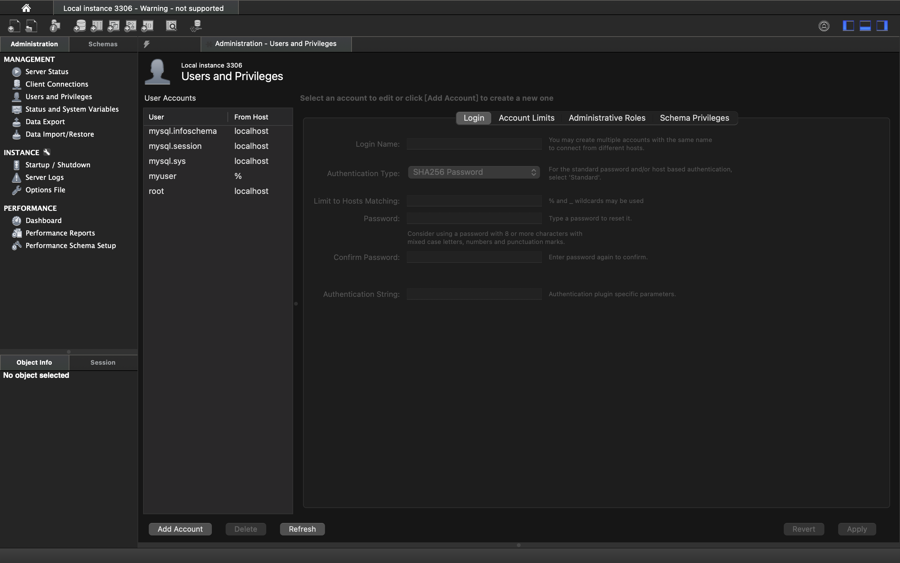

## 安装环境
之前已经成功下载mysql

workbench 连接成功

Create a new DB and import some schemas

add db user

new connection

new DB

修改Default Schema

创建table

IMPORT DATA OF LABS

Disable Safe Updates

导入DDL_createtbwithpredrop_al.sql

导入largeRelationsInsertFile.sql

pycharm连接成功

## quiz
Import all data of textbook 
见上，已成功导入两个文件

retrieve all info of student in Comp.Sci Dept

## 遇到的问题
1. 一开始workbench不知道点哪里运行，后来上网搜索知道了是点击第一个小闪电⚡️图标。
2. Disable Safe Updates这步看ppt中是打对勾的，以为这一项要勾上，做到后面发现不对了，重新回去再看才发现是让**disable**。（建议ppt把这个图换成取消打勾后的结果）

