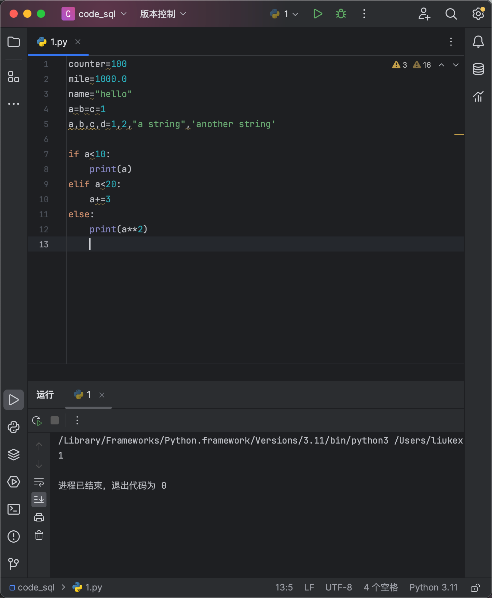
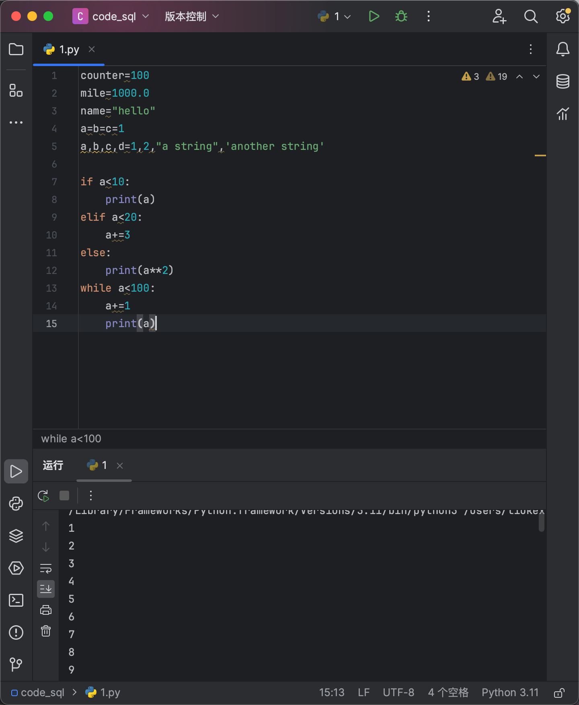
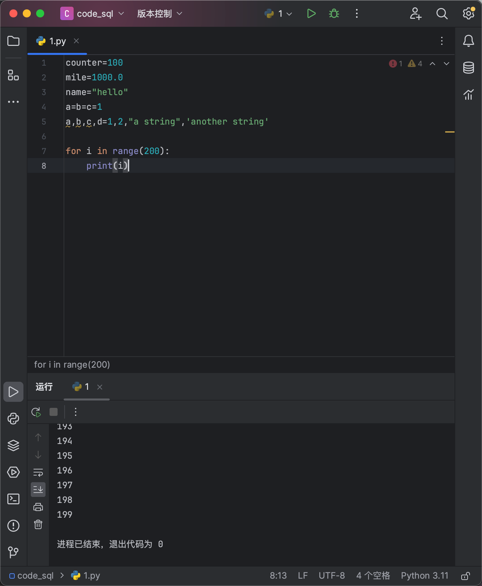
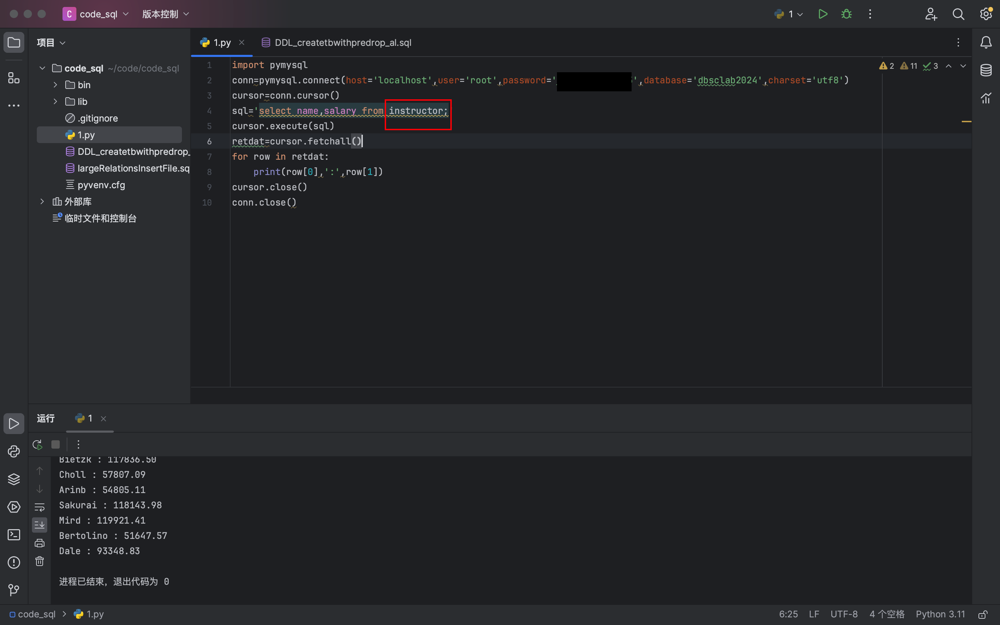
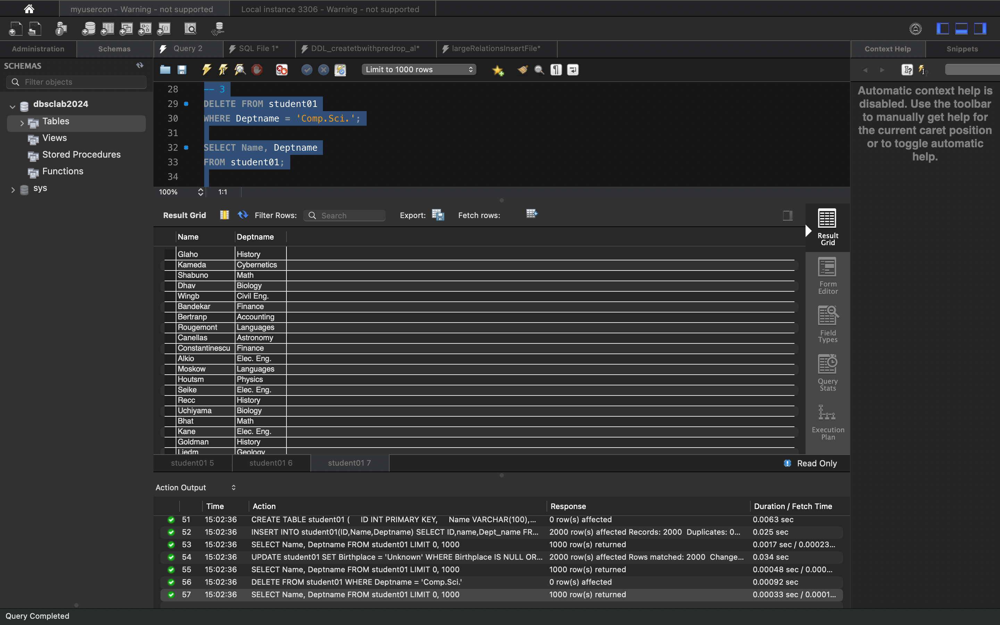
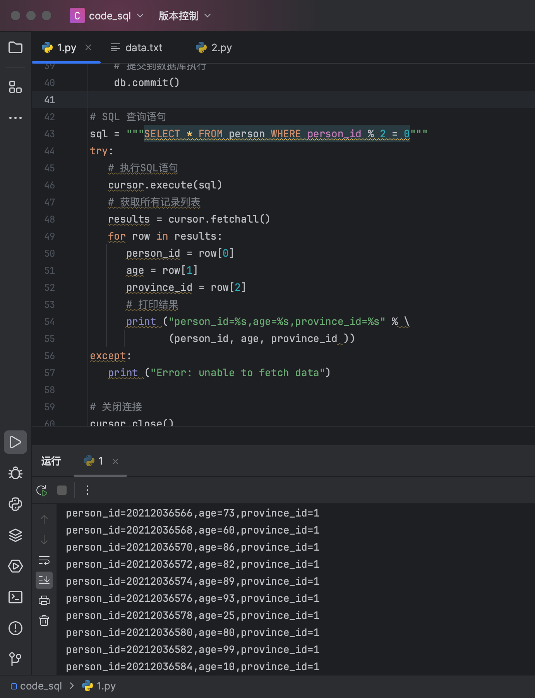
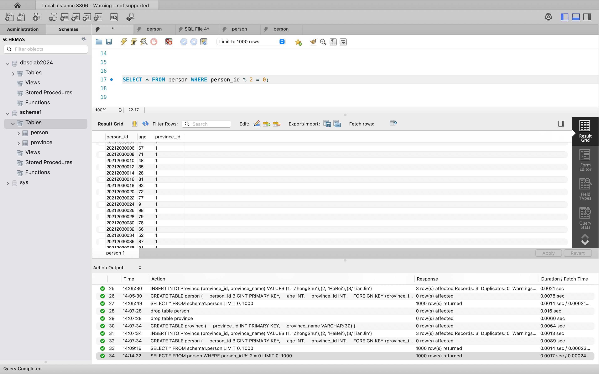

## lab03  2213513   刘可新
### BASIC PROGRAMMING OF PYTHON




while语句


for语句


（上次给的数据没有teacher表，所以就用了instructor）


要先drop student01才能drop department01，因为student01参照department01。
```sql
-- 创建部门表
CREATE TABLE department01 (
  Deptname VARCHAR(50) PRIMARY KEY,
  Location VARCHAR(100)
);

-- 创建学生表，并定义Deptname列
CREATE TABLE student01 (
    ID INT PRIMARY KEY,
    Name VARCHAR(100),
    Birthplace VARCHAR(100),
    Deptname VARCHAR(50)
);

-- 向学生表添加外键约束
ALTER TABLE student01
ADD FOREIGN KEY (Deptname) REFERENCES department01(Deptname);

-- 向部门表添加记录
INSERT INTO department01 (Deptname, Location) VALUES
('计算机科学', '北京'),
('国际商务', '上海'),
('机械工程', '广州'),
('金融学', '深圳'),
('教育学', '杭州');

-- 向学生表添加五名学生记录
INSERT INTO student01 (ID, Name, Birthplace, Deptname) VALUES
(1, '张三', '北京', '计算机'),
(2, '李四', '上海', '物理'),
(3, '王五', '广州', '机械工程'),
(4, '赵六', '深圳', '金融学'),
(5, '孙七', '杭州', '汉语言');

-- 删除部门表
DROP TABLE student01;
DROP TABLE department01;

```


```sql
-- 创建部门表
CREATE TABLE department01 (
  Deptname VARCHAR(50) PRIMARY KEY,
  Location VARCHAR(100)
);

-- 创建学生表，并定义Deptname列
CREATE TABLE student01 (
    ID INT PRIMARY KEY,
    Name VARCHAR(100),
    Birthplace VARCHAR(100),
    Deptname VARCHAR(50)
);
-- 1
INSERT INTO student01(ID,Name,Deptname)
SELECT ID,name,Dept_name
FROM student;
-- 2
SELECT Name, Deptname
FROM student01;
-- 3
UPDATE student01
SET Birthplace = 'Unknown'
WHERE Birthplace IS NULL OR Birthplace = '';

SELECT Name, Deptname
FROM student01;
-- 4
DELETE FROM student01
WHERE Deptname = 'Comp.Sci.';

SELECT Name, Deptname
FROM student01;

```
成功运行的截图



### quiz2
用python的pymysql库实现
生成9000行数据这里卡了很久

```sql
import random  
import pymysql  
  
# 创建连接到MySQL数据库  
db = pymysql.connect(user='root', password='', host='localhost', database='schema1')  
cursor = db.cursor()  
  
sql = """CREATE TABLE province (    
    province_id INT PRIMARY KEY,    province_name VARCHAR(30))"""  
try:  
    # 执行sql语句  
    cursor.execute(sql)  
    # 提交到数据库执行  
    db.commit()  
except:  
    # Rollback in case there is any error  
    db.rollback()  
  
sql = """INSERT INTO Province (province_id, province_name) VALUES (1, 'ZhongShu'),(2, 'HeBei'),(3,'TianJin')"""  
try:  2
    cursor.execute(sql)  
    db.commit()  
except:  
    db.rollback()  
  
sql = """CREATE TABLE person (    
    person_id BIGINT PRIMARY KEY,    age INT,    province_id INT,    FOREIGN KEY (province_id) REFERENCES Province(province_id))"""  
try:  
    cursor.execute(sql)  
    db.commit()  
except:  
    db.rollback()  
  
# 要求person_id从20212030001递增到20212039000，  
# age 为0-100之间的随机数，  
# 最后一位默认为1（zhongshu）  
for i in range(20212030001, 20212039001):  
    cursor.execute("insert into person(person_id, age, province_id) values(%s, %s, 1)", (i, random.randint(0, 100)))  
    # 提交到数据库执行  
    db.commit()  
  
# SQL 查询语句  
sql = """SELECT * FROM person WHERE person_id % 2 = 0"""  
try:  
   # 执行SQL语句  
   cursor.execute(sql)  
   # 获取所有记录列表  
   results = cursor.fetchall()  
   for row in results:  
      person_id = row[0]  
      age = row[1]  
      province_id = row[2]  
      # 打印结果  
      print ("person_id=%s,age=%s,province_id=%s" % \  
             (person_id, age, province_id ))  
except:  
   print ("Error: unable to fetch data")  
  
# 关闭连接  
cursor.close()  
db.close()
```



用workbench查询所有id为偶数的person



### 遇到的问题
1. 之前workbench一直是深色模式没有关键字高亮，十分难受，搜了很久没找到更改方式，后来发现是它跟随系统主题颜色，系统调整为浅色workbench颜色也就成浅色了，但又不想改系统颜色，最后搜到了一篇博客找到了更改方法[Mac 上修改 MySQL Workbench 主题配色-CSDN博客](https://blog.csdn.net/qq_35752021/article/details/106677297)
2. pymysql参考学习[Python 操作 MySQL 数据库 | 菜鸟教程 (runoob.com)](https://www.runoob.com/python/python-mysql.html)

