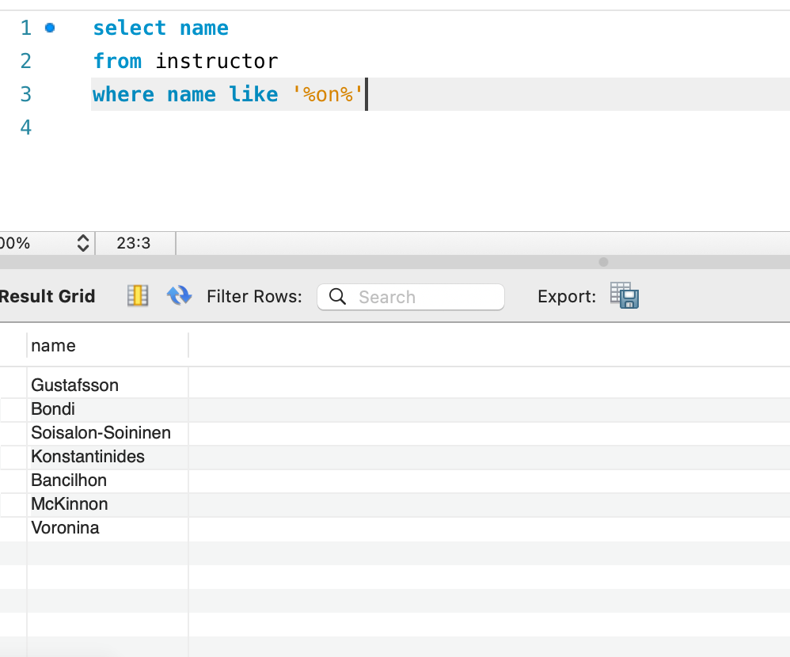

## lab04  2213513   刘可新
### basic queries


### natural join


`as`的使用


### String operation


### Ordering the display of tuples
排序


### Set operation


### Aggregate Functions

### Nested Subqueries


### Quiz
各学院有多少学生，按学院名称降序排序

2. 列出有大于等于310名学生参加的课程的课程ID,课程名的前5个字符、以及学期学年等信息

3. 列出所有由Dale教过的学生的学生ID、学生姓名等信息，不要有重复记录

4. 成绩均在A,A+,A-以上的学生及其所有课程和成绩
```sql
WITH table1 AS (
  SELECT s.ID, t.course_id, t.grade, COUNT(t.course_id) AS num_grade_A
  FROM student s 
  JOIN takes t ON s.ID = t.ID
  WHERE t.grade LIKE '%A%'
  GROUP BY s.ID, t.course_id, t.grade
),
table2 AS (
  SELECT s.ID, t.course_id, COUNT(t.course_id) AS num_courses
  FROM student s 
  JOIN takes t ON s.ID = t.ID
  GROUP BY s.ID, t.course_id
)
SELECT t1.ID, t1.course_id, t1.grade
FROM table1 t1
JOIN table2 t2 ON t1.ID = t2.ID AND t1.course_id = t2.course_id
WHERE t1.num_grade_A = t2.num_courses;
```

5. 获得所有学院中预算的均值和中位数
```sql
-- 计算平均预算
SELECT AVG(budget) AS average_budget FROM department;
```
首先对预算进行排序，并为每一行分配一个序号（`rn`），然后计算总的部门数量（`cnt`）。在外层查询中，如果部门的数量是偶数，选择两个中间的值，然后计算它们的平均值作为中位数；如果是奇数，则中间那个值就是中位数
