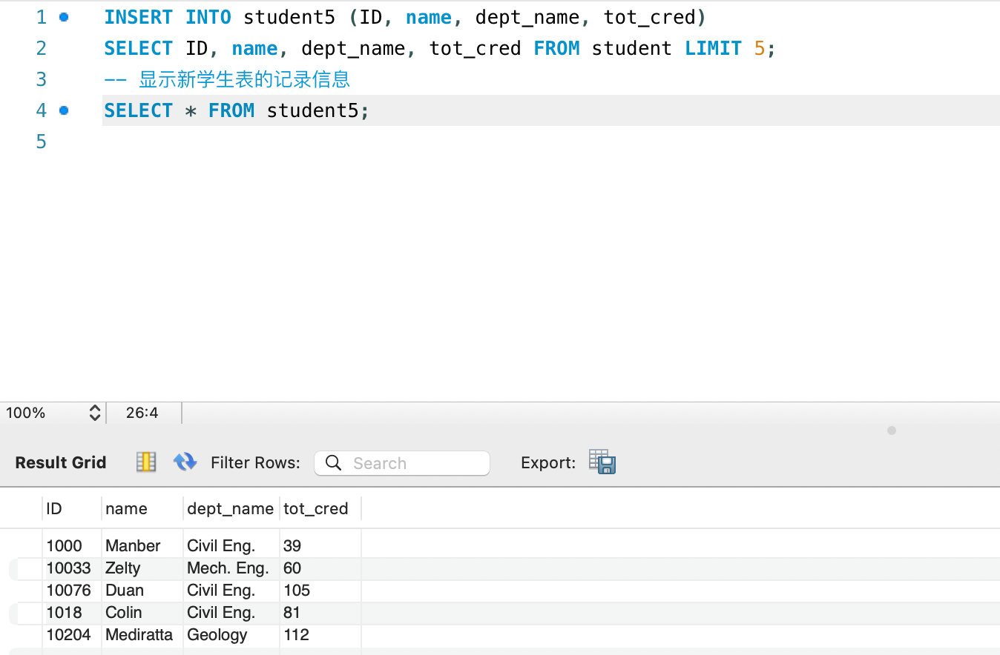
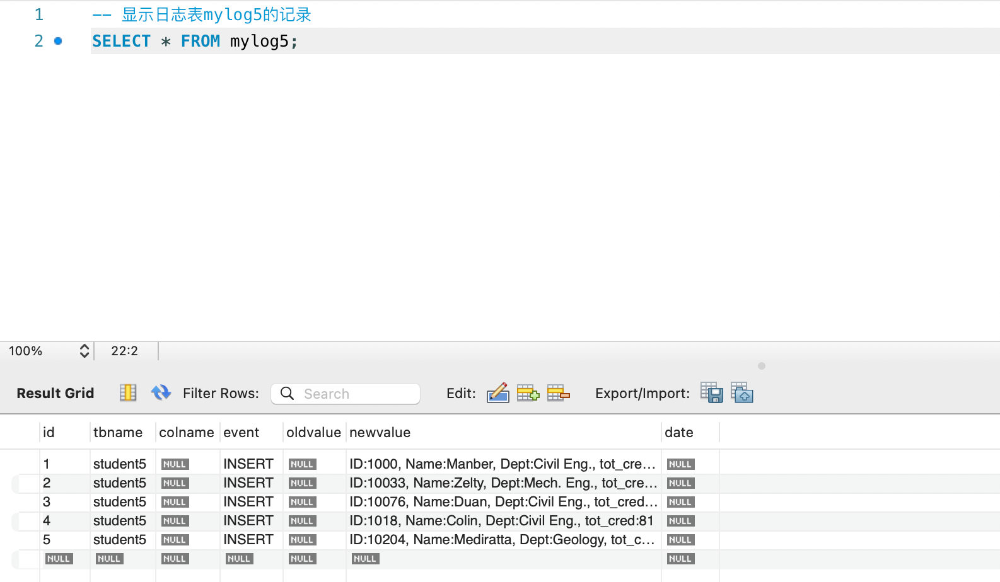
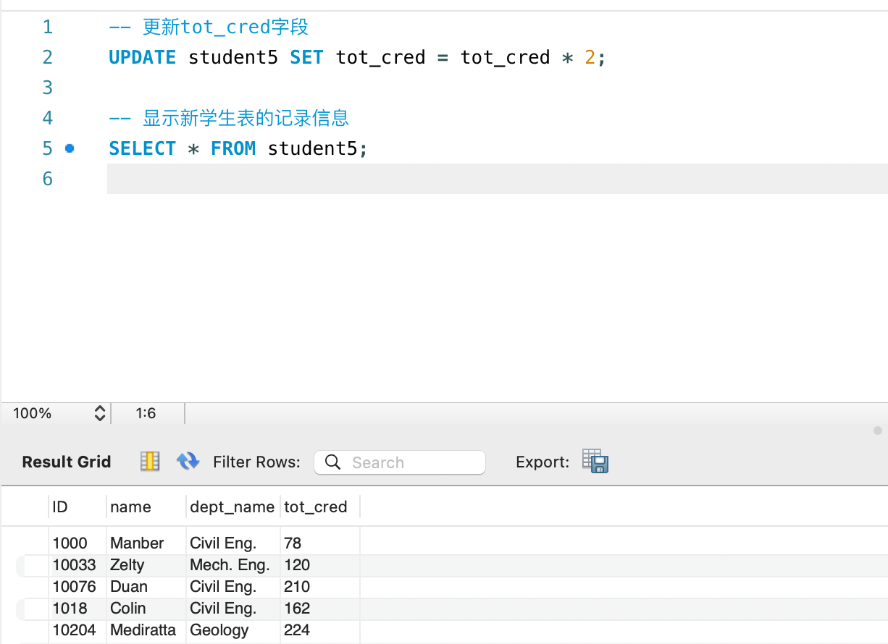
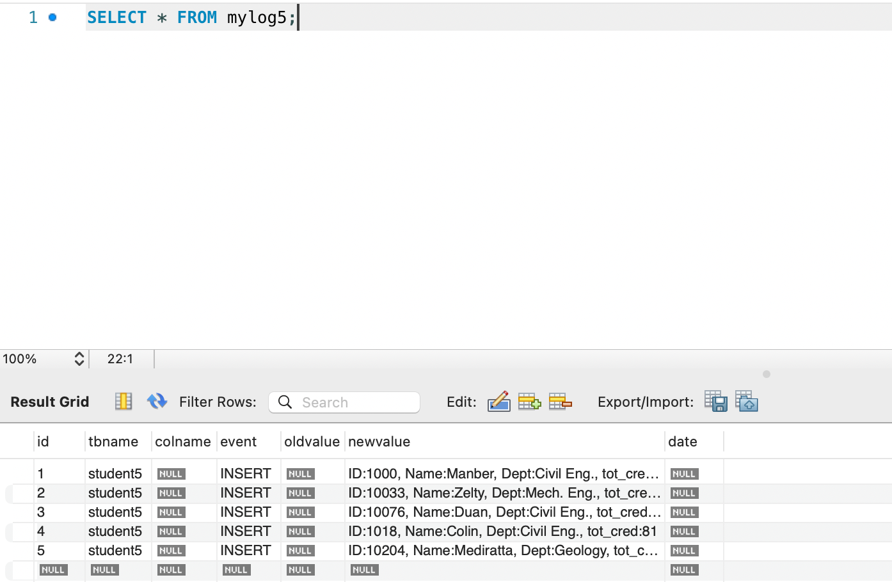
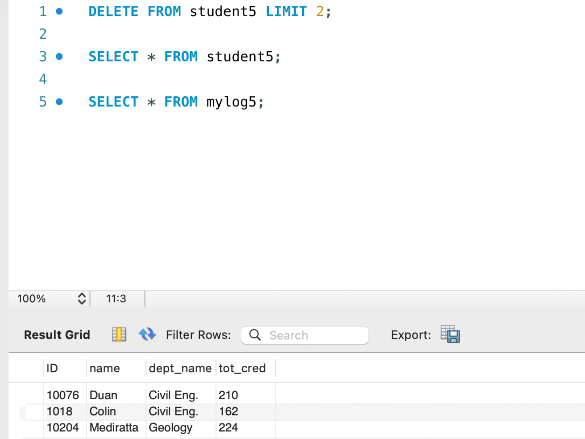
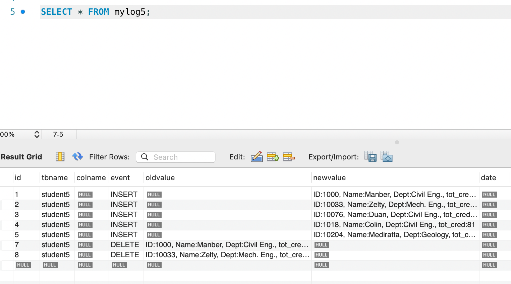

 ## lab06  2213513   刘可新
触发器
1. 创建一个新学生表student5,该表的元祖集合为空值

```sql
CREATE TABLE student5 AS SELECT * FROM student WHERE 1=0;
```

2. 创建日志表mylog5,属性包括id,tbname,colname,event,oldvalue,newvalue,date等字段，其中id为自增长字段$auto\_increment$
```sql
CREATE TABLE mylog5 (
  id INT AUTO_INCREMENT PRIMARY KEY,
  tbname VARCHAR(255),
  colname VARCHAR(255),
  event ENUM('INSERT', 'DELETE', 'UPDATE'),
  oldvalue TEXT,
  newvalue TEXT,
  date DATETIME
);
```

3. 针对新学生表student5，增加插入、删除两个触发器，记录对该表操作的事件类型和相关值到日志表mylog5
```sql
DELIMITER //  
CREATE TRIGGER trg_student5_insert  
AFTER INSERT ON student5  
FOR EACH ROW  
BEGIN  
    INSERT INTO mylog5 (tbname, colname, event, oldvalue, newvalue)  
    VALUES ('student5', NULL, 'INSERT', NULL, CONCAT('ID:', NEW.ID, ', Name:', NEW.name, ', Dept:', NEW.dept_name, ', tot_cred:', NEW.tot_cred));  
END;  
//  
DELIMITER ;
```
删除触发器
```sql
DELIMITER //  
CREATE TRIGGER trg_student5_delete  
AFTER DELETE ON student5  
FOR EACH ROW  
BEGIN  
    INSERT INTO mylog5 (tbname, colname, event, oldvalue, newvalue)  
    VALUES ('student5', NULL, 'DELETE', CONCAT('ID:', OLD.ID, ', Name:', OLD.name, ', Dept:', OLD.dept_name, ', tot_cred:', OLD.tot_cred), NULL);  
END;  
//  
DELIMITER ;
```
4. 从原学生表student中导入5个记录信息到新学生表student5,显示导入前后新学生表的记录信息和日志表mylog5;



5. 在新学生表student5对所有学生的tot_cred在原来基础上增加一倍，显示修改前后新学生表的记录信息和日志表mylog5;



6. 删除新学生表student5中的2个记录，显示删除前后新学生表的记录信息和日志表mylog5;

7. 查看日志表mylog5中的记录情况
