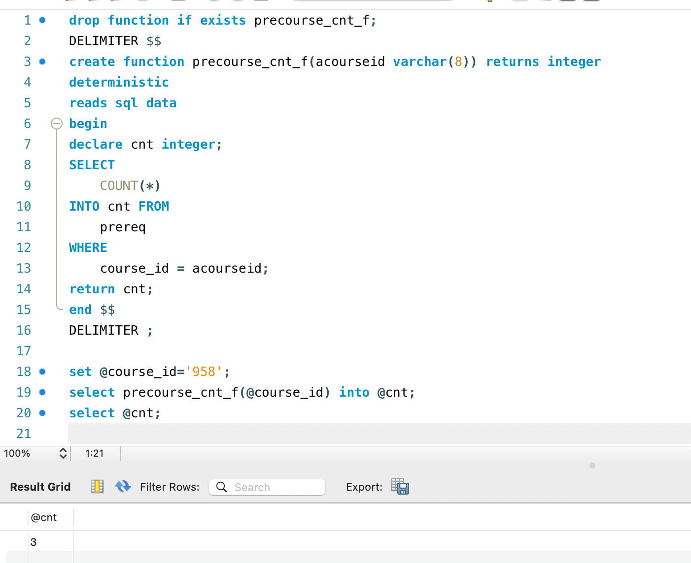
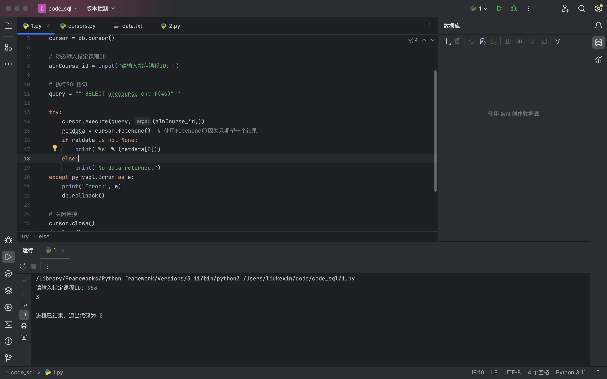

## lab07  2213513 刘可新

首先在workbench中创建函数，实现获取制定课程的所有依赖课程。
然后在pycharm中运行下列代码，实现可以动态输入id，调用上述函数查询，将结果获取并输出。

```python
import pymysql  
  
db = pymysql.connect(user='root', password='', host='localhost', database='dbsclab2024')  
cursor = db.cursor()  
  
# 动态输入指定课程ID  
aInCourse_id = input("请输入指定课程ID: ")  
  
query = """SELECT precourse_cnt_f(%s)"""  
  
try:  
    cursor.execute(query, (aInCourse_id,))  
    retdata = cursor.fetchone() 
    if retdata is not None:  
        print("%s" % (retdata[0]))  
    else:  
        print("No data returned.")  
except pymysql.Error as e:  
    print("Error:", e)  
    db.rollback()  
  
# 关闭连接  
cursor.close()  
db.close()

```

成功运行截图
