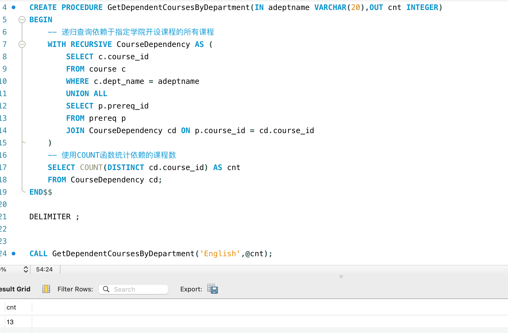
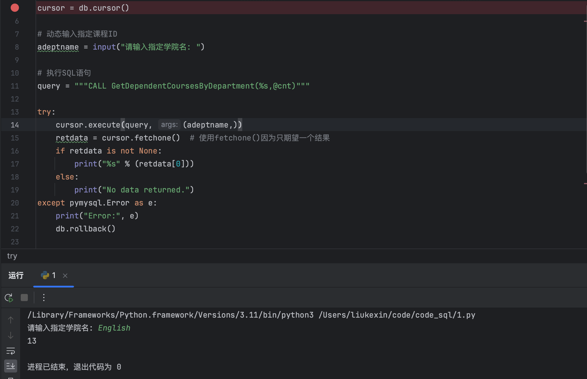

# lab08  2213513 刘可新

首先，使用`CREATE PROCEDURE`语句来创建一个存储过程
输入学院名，查询依赖于指定学院开设课程的所有课程，
使用COUNT函数统计依赖的课程数，输出该值
```sql
-- drop procedure if exists GetDependentCoursesByDepartment;
DELIMITER $$

CREATE PROCEDURE GetDependentCoursesByDepartment(IN adeptname VARCHAR(20),OUT cnt INTEGER)
BEGIN
    -- 递归查询依赖于指定学院开设课程的所有课程
    WITH RECURSIVE CourseDependency AS (
        SELECT c.course_id
        FROM course c
        WHERE c.dept_name = adeptname
        UNION ALL
        SELECT p.prereq_id
        FROM prereq p
        JOIN CourseDependency cd ON p.course_id = cd.course_id
    )
    -- 使用COUNT函数统计依赖的课程数
    SELECT COUNT(DISTINCT cd.course_id) AS cnt
    FROM CourseDependency cd;
END$$

DELIMITER ;


CALL GetDependentCoursesByDepartment('English',@cnt);
```

采用python调用并显示结果
```python
import pymysql  
  
# 创建连接到MySQL数据库  
db = pymysql.connect(user='root', password='', host='localhost', database='dbsclab2024')  
cursor = db.cursor()  
  
# 动态输入指定课程ID  
adeptname = input("请输入指定学院名: ")  
  
# 执行SQL语句  
query = """CALL GetDependentCoursesByDepartment(%s,@cnt)"""  
  
try:  
    cursor.execute(query, (adeptname,))  
    retdata = cursor.fetchone()  # 使用fetchone()因为只期望一个结果  
    if retdata is not None:  
        print("%s" % (retdata[0]))  
    else:  
        print("No data returned.")  
except pymysql.Error as e:  
    print("Error:", e)  
    db.rollback()  
  
# 关闭连接  
cursor.close()  
db.close()
```
成功运行截图
