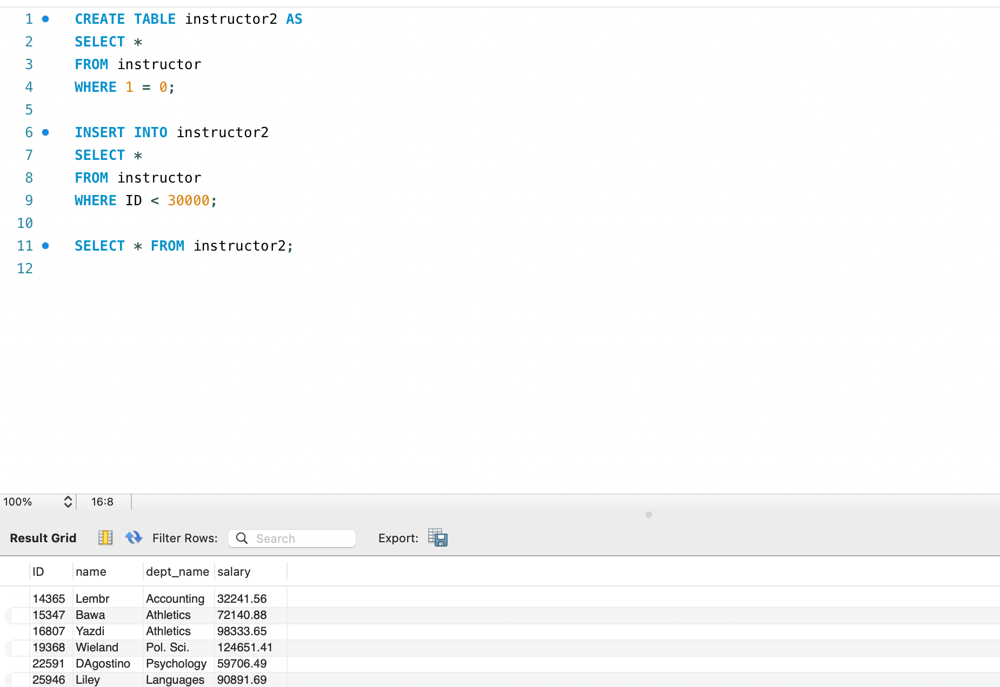
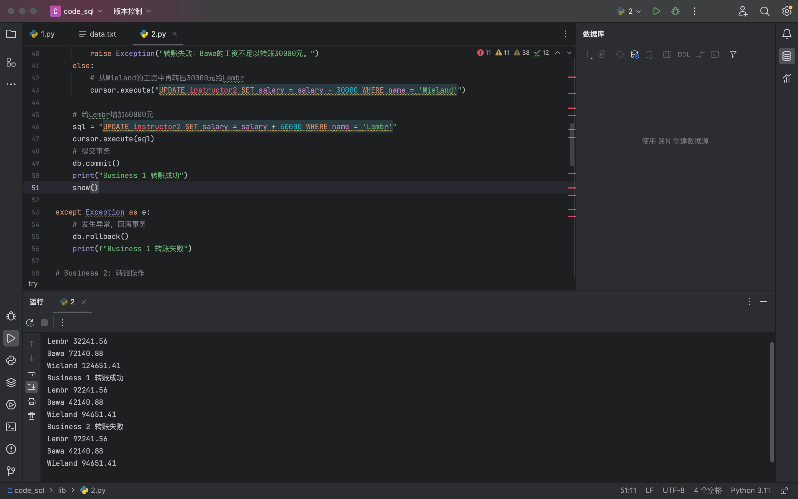

# lab09  2213513 刘可新
1.创建一个教师表instructor2
把ID是30000以前的教师从instructor表中导入
并显示所有教师instructor2的信息


两个业务：

```python
import pymysql  
  
# 创建连接到MySQL数据库  
db = pymysql.connect(user='root', password='', host='localhost', database='dbsclab2024')  
cursor = db.cursor()  

# 显示三人工资的函数
def show():  
    sql = "SELECT name, salary FROM instructor2 WHERE name IN ('Bawa', 'Lembr', 'Wieland')"  
  
    try:  
        cursor.execute(sql)  
        results = cursor.fetchall()  
        for row in results:  
            name = row[0]  
            salary = row[1]  
            print("%s %s" % \  
                  (name, salary))  
    except:  
        db.rollback()  
        print("Error: unable to fetch data")  
  
show()  
  
# Business 1: 转账操作  
try:  
    # 检查Bawa的工资是否足够转账  
    cursor.execute("SELECT salary FROM instructor2 WHERE name = 'Bawa'")  
    result = cursor.fetchone()  
    if result[0] < 30000:  
        raise Exception("转账失败：Bawa的工资不足以转账30000元。")  
    else:  
        # 从Bawa的工资中再转出30000元给Lembr  
        cursor.execute("UPDATE instructor2 SET salary = salary - 30000 WHERE name = 'Bawa'")  
  
    # 检查Wieland的工资是否足够转账  
    cursor.execute("SELECT salary FROM instructor2 WHERE name = 'Wieland'")  
    result = cursor.fetchone()  
    if result[0] < 30000:  
        raise Exception("转账失败：Bawa的工资不足以转账30000元。")  
    else:  
        # 从Wieland的工资中再转出30000元给Lembr  
        cursor.execute("UPDATE instructor2 SET salary = salary - 30000 WHERE name = 'Wieland'")  
  
    # 给Lembr增加60000元  
    sql = "UPDATE instructor2 SET salary = salary + 60000 WHERE name = 'Lembr'"  
    cursor.execute(sql)  
    # 提交事务  
    db.commit()  
    print("Business 1 转账成功")  
    show()  
  
except Exception as e:  
    db.rollback()  
    print(f"Business 1 转账失败")  
  
# Business 2: 转账操作  
try:  
    # 检查Lembr的工资是否足够转账  
    cursor.execute("SELECT salary FROM instructor2 WHERE name = 'Lembr'")  
    result = cursor.fetchone()  
    if result[0] < 1000:  
        raise Exception("转账失败：Lembr的工资不足以转账1000元。")  
    else:  
        # 从Lembr的工资中再转出1000元给Wieland  
        cursor.execute("UPDATE instructor2 SET salary = salary - 1000 WHERE name = 'Lembr'")  
  
    # 检查Bawa的工资是否足够转账  
    cursor.execute("SELECT salary FROM instructor2 WHERE name = 'Bawa'")  
    result = cursor.fetchone()  
    if result[0] < 100000:  
        raise Exception("转账失败：Bawa的工资不足以转账100000元。")  
    else:  
        # 从Bawa的工资中再转出100000元给Wieland  
        cursor.execute("UPDATE instructor2 SET salary = salary - 100000 WHERE name = 'Bawa'")  
  
    # 给Wieland增加101000元  
    cursor.execute("UPDATE instructor2 SET salary = salary + 101000 WHERE name = 'Wieland'")  
  
    # 提交事务  
    db.commit()  
    print("Business 2 转账成功")  
  
except Exception as e:  
    # 发生异常，回滚事务  
    db.rollback()  
    print(f"Business 2 转账失败")  
  
# 显示业务2后的工资  
show()  
  
  
cursor.close()  
db.close()
```

成功运行截图：
