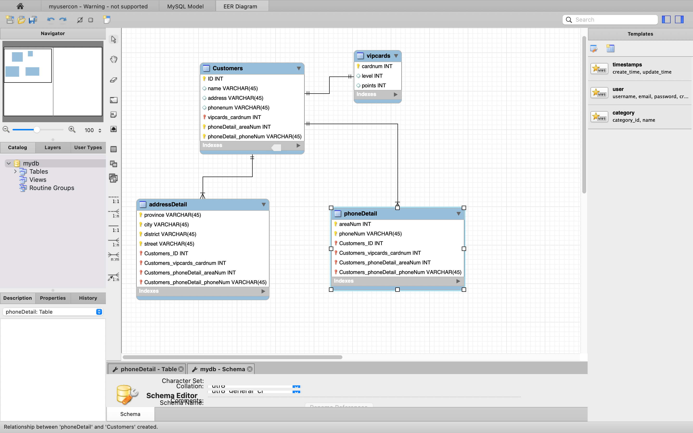
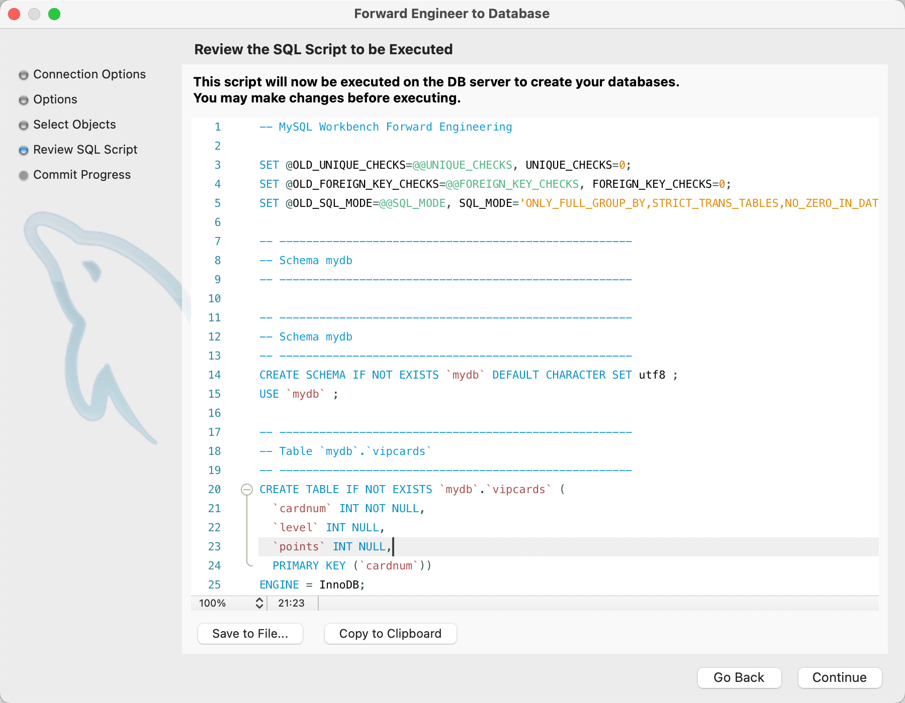

# lab10  2213513 刘可新
先开始创建


分析：
- **实体**：
    - 顾客（Customers）
    - 会员卡（VipCards）
    - 地址（addressDetail）
    - 电话号码（PhoneDetail）
- **属性**：
    - 顾客：ID（主键）、name、address、phonenum
    - 会员卡：cardnum（主键）、level、points
    - 地址：Province）、City、District、Street
    - 电话号码：AreaNum、phoneNum
- **联系**：
    - 顾客与会员卡：一对一（1:1），每个顾客只能办理一张会员卡。
    - 顾客与地址：一对多（1:N），一个顾客可以有多个地址。
    - 顾客与电话号码：一对多（1:N），一个顾客可以有多个电话号码。
画出E-R模型



生成对应脚本


```sql
-- MySQL Workbench Forward Engineering

SET @OLD_UNIQUE_CHECKS=@@UNIQUE_CHECKS, UNIQUE_CHECKS=0;
SET @OLD_FOREIGN_KEY_CHECKS=@@FOREIGN_KEY_CHECKS, FOREIGN_KEY_CHECKS=0;
SET @OLD_SQL_MODE=@@SQL_MODE, SQL_MODE='ONLY_FULL_GROUP_BY,STRICT_TRANS_TABLES,NO_ZERO_IN_DATE,NO_ZERO_DATE,ERROR_FOR_DIVISION_BY_ZERO,NO_ENGINE_SUBSTITUTION';

-- -----------------------------------------------------
-- Schema mydb
-- -----------------------------------------------------

-- -----------------------------------------------------
-- Schema mydb
-- -----------------------------------------------------
CREATE SCHEMA IF NOT EXISTS `mydb` DEFAULT CHARACTER SET utf8 ;
USE `mydb` ;

-- -----------------------------------------------------
-- Table `mydb`.`vipcards`
-- -----------------------------------------------------
CREATE TABLE IF NOT EXISTS `mydb`.`vipcards` (
  `cardnum` INT NOT NULL,
  `level` INT NULL,
  `points` INT NULL,
  PRIMARY KEY (`cardnum`))
ENGINE = InnoDB;


-- -----------------------------------------------------
-- Table `mydb`.`Customers`
-- -----------------------------------------------------
CREATE TABLE IF NOT EXISTS `mydb`.`Customers` (
  `ID` INT NOT NULL,
  `name` VARCHAR(45) NULL,
  `address` VARCHAR(45) NULL,
  `phonenum` VARCHAR(45) NULL,
  `vipcards_cardnum` INT NOT NULL,
  `phoneDetail_areaNum` INT NOT NULL,
  `phoneDetail_phoneNum` VARCHAR(45) NOT NULL,
  PRIMARY KEY (`ID`, `vipcards_cardnum`, `phoneDetail_areaNum`, `phoneDetail_phoneNum`),
  UNIQUE INDEX `ID_UNIQUE` (`ID` ASC) VISIBLE,
  INDEX `fk_Customers_vipcards1_idx` (`vipcards_cardnum` ASC) VISIBLE,
  CONSTRAINT `fk_Customers_vipcards1`
    FOREIGN KEY (`vipcards_cardnum`)
    REFERENCES `mydb`.`vipcards` (`cardnum`)
    ON DELETE NO ACTION
    ON UPDATE NO ACTION)
ENGINE = InnoDB;


-- -----------------------------------------------------
-- Table `mydb`.`addressDetail`
-- -----------------------------------------------------
CREATE TABLE IF NOT EXISTS `mydb`.`addressDetail` (
  `province` VARCHAR(45) NOT NULL,
  `city` VARCHAR(45) NOT NULL,
  `district` VARCHAR(45) NOT NULL,
  `street` VARCHAR(45) NOT NULL,
  `Customers_ID` INT NOT NULL,
  `Customers_vipcards_cardnum` INT NOT NULL,
  `Customers_phoneDetail_areaNum` INT NOT NULL,
  `Customers_phoneDetail_phoneNum` VARCHAR(45) NOT NULL,
  PRIMARY KEY (`province`, `city`, `district`, `street`, `Customers_ID`, `Customers_vipcards_cardnum`, `Customers_phoneDetail_areaNum`, `Customers_phoneDetail_phoneNum`),
  INDEX `fk_addressDetail_Customers1_idx` (`Customers_ID` ASC, `Customers_vipcards_cardnum` ASC, `Customers_phoneDetail_areaNum` ASC, `Customers_phoneDetail_phoneNum` ASC) VISIBLE,
  CONSTRAINT `fk_addressDetail_Customers1`
    FOREIGN KEY (`Customers_ID` , `Customers_vipcards_cardnum` , `Customers_phoneDetail_areaNum` , `Customers_phoneDetail_phoneNum`)
    REFERENCES `mydb`.`Customers` (`ID` , `vipcards_cardnum` , `phoneDetail_areaNum` , `phoneDetail_phoneNum`)
    ON DELETE NO ACTION
    ON UPDATE NO ACTION)
ENGINE = InnoDB;


-- -----------------------------------------------------
-- Table `mydb`.`phoneDetail`
-- -----------------------------------------------------
CREATE TABLE IF NOT EXISTS `mydb`.`phoneDetail` (
  `areaNum` INT NOT NULL,
  `phoneNum` VARCHAR(45) NOT NULL,
  `Customers_ID` INT NOT NULL,
  `Customers_vipcards_cardnum` INT NOT NULL,
  `Customers_phoneDetail_areaNum` INT NOT NULL,
  `Customers_phoneDetail_phoneNum` VARCHAR(45) NOT NULL,
  PRIMARY KEY (`areaNum`, `phoneNum`, `Customers_ID`, `Customers_vipcards_cardnum`, `Customers_phoneDetail_areaNum`, `Customers_phoneDetail_phoneNum`),
  INDEX `fk_phoneDetail_Customers1_idx` (`Customers_ID` ASC, `Customers_vipcards_cardnum` ASC, `Customers_phoneDetail_areaNum` ASC, `Customers_phoneDetail_phoneNum` ASC) VISIBLE,
  CONSTRAINT `fk_phoneDetail_Customers1`
    FOREIGN KEY (`Customers_ID` , `Customers_vipcards_cardnum` , `Customers_phoneDetail_areaNum` , `Customers_phoneDetail_phoneNum`)
    REFERENCES `mydb`.`Customers` (`ID` , `vipcards_cardnum` , `phoneDetail_areaNum` , `phoneDetail_phoneNum`)
    ON DELETE NO ACTION
    ON UPDATE NO ACTION)
ENGINE = InnoDB;


SET SQL_MODE=@OLD_SQL_MODE;
SET FOREIGN_KEY_CHECKS=@OLD_FOREIGN_KEY_CHECKS;
SET UNIQUE_CHECKS=@OLD_UNIQUE_CHECKS;

```