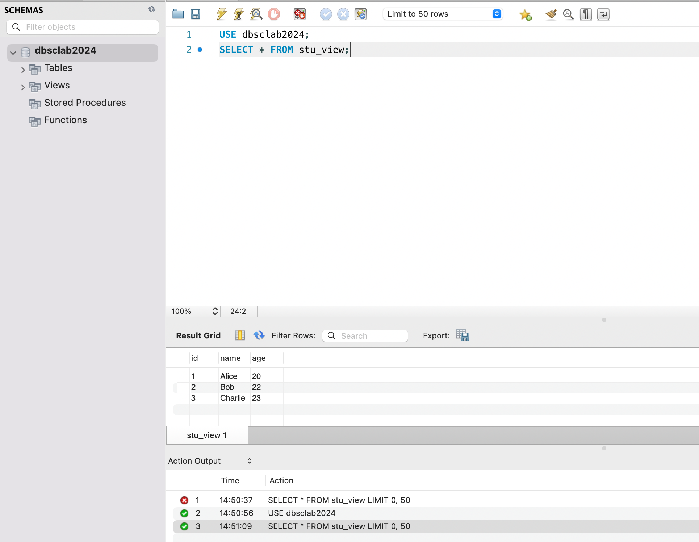
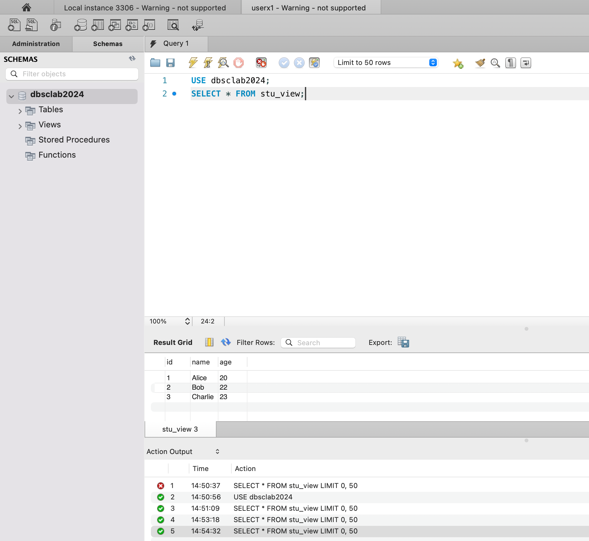
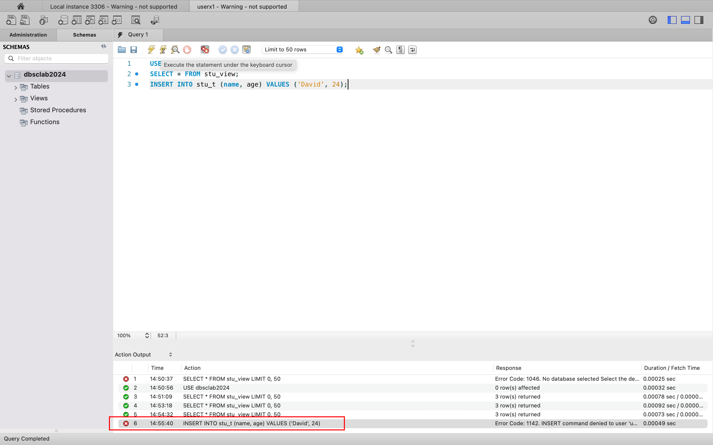
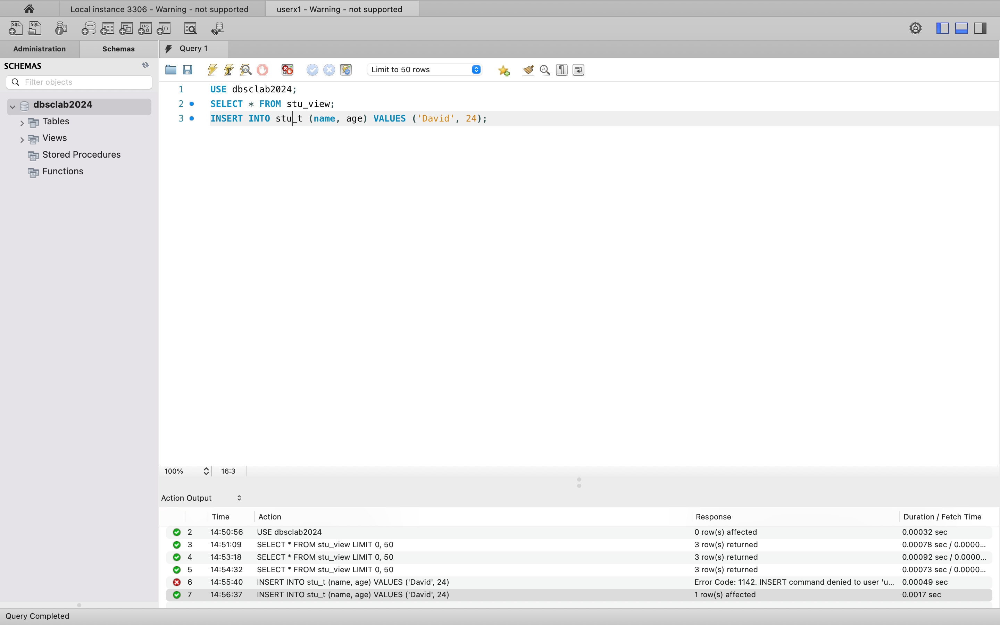
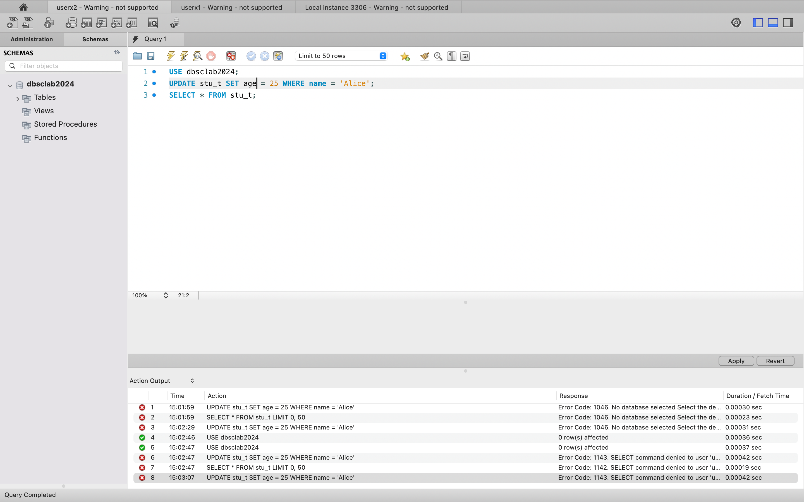
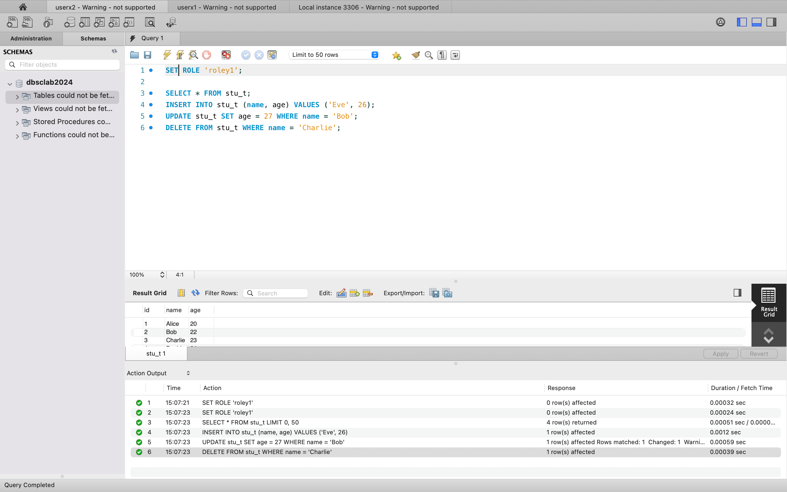
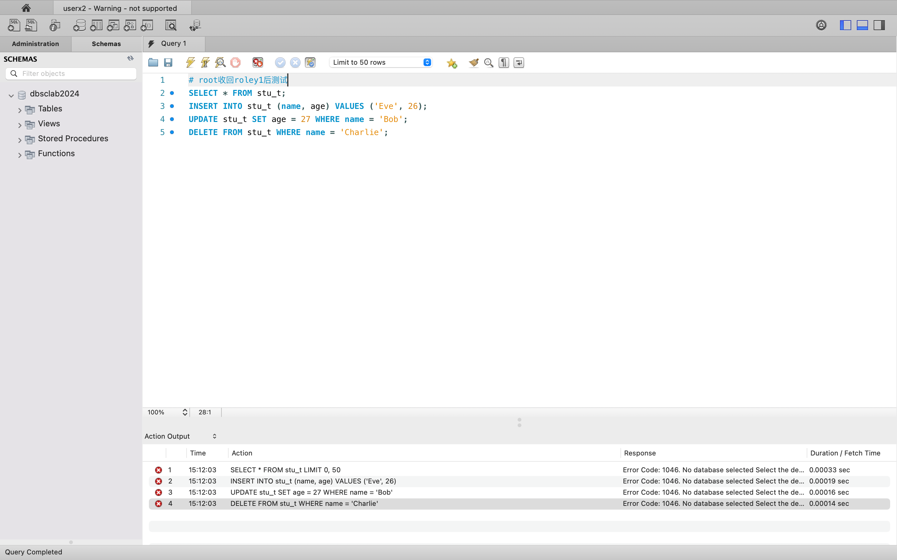

# lab11  2213513 刘可新
1.创建两个新用户userx1,userx.2,userx3;
2.创建一个角色roley1;
3.创建个学生表stu_t,并插入一些数据；
4.创建一个基于stu_t的视图stu_view
```sql
CREATE USER 'userx1'@'localhost' IDENTIFIED BY 'password';
CREATE USER 'userx2'@'localhost' IDENTIFIED BY 'password';
CREATE USER 'userx3'@'localhost' IDENTIFIED BY 'password';

CREATE ROLE 'roley1';

CREATE TABLE stu_t (
    id INT PRIMARY KEY AUTO_INCREMENT,
    name VARCHAR(50),
    age INT
);

INSERT INTO stu_t (name, age) VALUES ('Alice', 20), ('Bob', 22), ('Charlie', 23);

CREATE VIEW stu_view AS SELECT * FROM stu_t;
```

5.授权userx1对stu_view有读权利
```sql
GRANT SELECT ON stu_view TO 'userx1'@'localhost';
```
退出当前连接，用userx1登陆。
测试userx1对stu_view是否可查询

可查询

6.授权userx1对stu_t有读权利，
```sql
GRANT SELECT ON stu_t TO 'userx1'@'localhost';
```
再次测试userx1对stu_view是否可查询

可查询

7.测试userx1对stu_t是否有插入权利，若没有则赋予插入权利，再测试之；

无插入权利
```sql
GRANT INSERT ON stu_t TO 'userx1'@'localhost';
```

可成功插入

8.授权userx2对stu_t有修改权利
```sql
GRANT UPDATE ON stu_t TO 'userx2'@'localhost';
```
测试userx2对stu_t是否有完全权利；

没有完全权利

9.授权roley1对stu_t有完全权利，并进一步将roley1授权给userx2
```sql
GRANT ALL PRIVILEGES ON stu_t TO 'roley1';
GRANT 'roley1' TO 'userx2'@'localhost';
```

测试userx2是否对stu_t有完全权利

这里要先激活角色roley1，userx2对stu_t有完全权利

9.以userx2为当前身份，试图将roley1授权给userx3,是否可行，如何办到？
不可行，因为 userx2 没有授权权限。
以root为当前身份可以办到。

10.收回userx2的roley1角色（root）
```sql
REVOKE 'roley1' FROM 'userx2'@'localhost';
```
测试userx2是否对stu_t是否有完全权利。


无完全权利